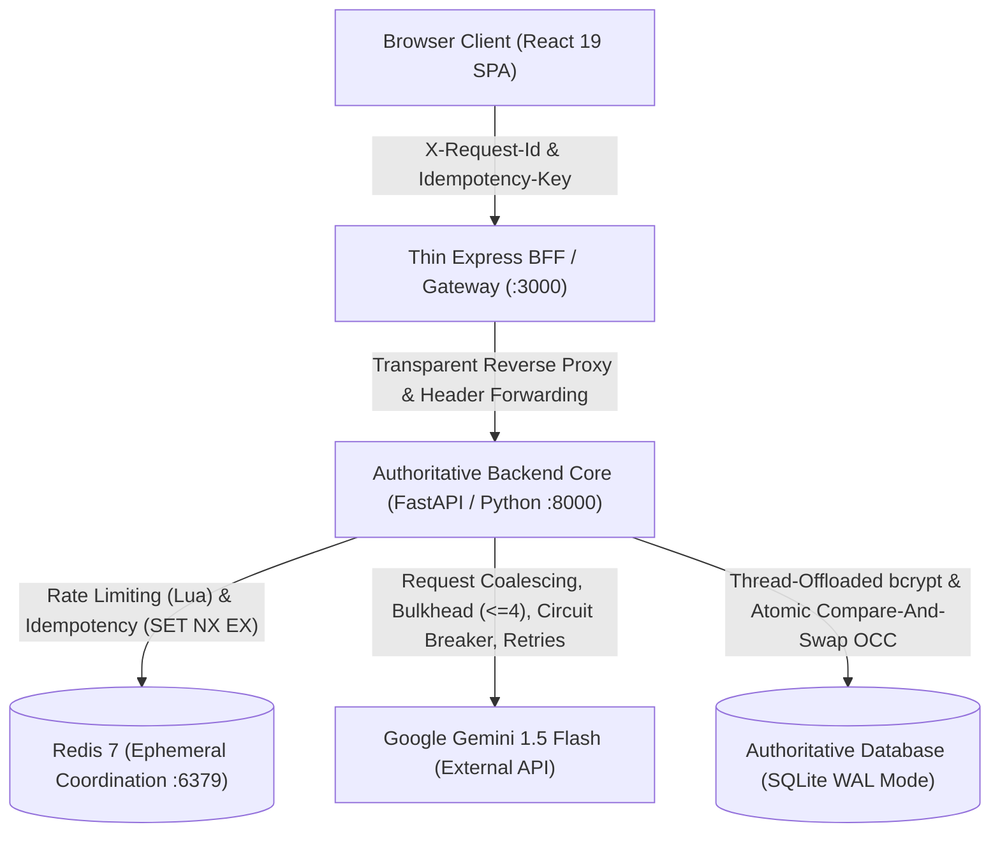

# IntelliResume 2026

> **Python / FastAPI Backend, Distributed Resilience Patterns & AI Resume Platform**

IntelliResume is a full-stack resume engineering application and **system-design reference implementation** demonstrating production-style backend engineering, resilience patterns, and AI orchestration in **Python and FastAPI**.

[](https://www.python.org/)
[](https://fastapi.tiangolo.com/)
[](https://redis.io/)
[](https://www.sqlite.org/)
[](https://react.dev/)
[](https://www.typescriptlang.org/)
[](https://www.docker.com/)

---

## 🏛️ System Architecture Overview



### Architectural Authority Principle
- **Python / FastAPI (Port 8000)** is the **authoritative backend layer** for all domain logic, persistence, concurrency controls, Redis coordination, and AI resilience patterns.
- **TypeScript / Express (Port 3000)** is a **thin BFF (Backend-For-Frontend)** dedicated strictly to static React asset serving, SPA fallback routing, and transparent reverse proxying to FastAPI with correlation header propagation.

---

## ⚡ Core Backend & Resilience Implementations

All resilience patterns are implemented natively in Python under [`backend/app/resilience/`](backend/app/resilience/):

| Pattern | Implementation | Technical Mechanism & Invariants | Failure Mode / Fallback |
|---|---|---|---|
| **Distributed Rate Limiting** | [`rate_limiter.py`](backend/app/resilience/rate_limiter.py) | Atomic Redis Lua script (`INCR` + conditional `EXPIRE`); token-based identity extraction | Degrades to in-memory sliding bucket counters if Redis disconnects |
| **Distributed Idempotency** | [`idempotency.py`](backend/app/resilience/idempotency.py) | Atomic `SET NX EX 60` locks; SHA-256 fingerprinting (`method:path:body`); 64KB response cache | 60s lock self-eviction on worker crash; returns `422` on payload mutation on same key |
| **Request Coalescing** | [`coalescing.py`](backend/app/resilience/coalescing.py) | Process-local `dict[str, asyncio.Future]` to multiplex simultaneous identical prompts to a single upstream call | Exception cleanly propagates to all attached listeners in `finally` block |
| **Bulkhead Isolation** | [`bulkhead.py`](backend/app/resilience/bulkhead.py) | `asyncio.Semaphore` pool: Max 4 active executions, Max 12 queued, 8.0s timeout | Rejects excess load with `503 AI_CAPACITY_EXCEEDED` / `AI_QUEUE_TIMEOUT` and `Retry-After: 5` |
| **Circuit Breaker** | [`circuit_breaker.py`](backend/app/resilience/circuit_breaker.py) | 3-state state machine (`CLOSED` $\to$ `OPEN` $\to$ `HALF_OPEN`); trips after 5 failures; 15s reset window | Fails fast in $<6\text{ms}$ returning deterministic Pydantic schema fallbacks |
| **Bounded Retry & Jitter** | [`retry.py`](backend/app/resilience/retry.py) | Exponential backoff with full randomized jitter ($t = \min(300\text{ms} \times 2^{\text{attempt}} + \text{jitter}, 2000\text{ms})$); max 2 attempts | Retries only transient upstream errors (`429`, `503`); never retries `4xx` |
| **Optimistic Concurrency Control** | [`routers/resumes.py`](backend/app/routers/resumes.py) | Atomic SQL Compare-And-Swap: `UPDATE resumes SET version = version + 1 WHERE id = :id AND version = :client_ver` | Returns `409 OPTIMISTIC_CONCURRENCY_CONFLICT`; client prompts interactive resolution |
| **Correlation Tracing** | [`correlation.py`](backend/app/core/correlation.py) | Header sanitization (`^[a-zA-Z0-9_.-]{1,64}$`) and async `contextvars` propagation | Generates sanitized UUID4 if missing or malformed (defends against log-injection) |
| **Isolated Vector PDF Export** | [`App.tsx`](frontend/src/App.tsx), [`index.css`](frontend/src/index.css) | Dedicated `#print-root` isolated DOM portal with A4 print CSS rules and `break-inside: avoid;` | Eliminates screen UI chrome and dark background leakage from printout |

---

## 📚 Backend Mastery & System Design Curriculum

Comprehensive backend study materials and development stories are located in [`docs/mastery/`](docs/mastery/):

1. 📖 **[`docs/mastery/README.md`](docs/mastery/README.md)** — Curriculum hub, study methodology, and navigation index.
2. 🏛️ **[`docs/mastery/ARCHITECTURE.md`](docs/mastery/ARCHITECTURE.md)** — Verified execution topology, component boundaries, database schemas, and request lifecycles.
3. 🛠️ **[`docs/mastery/BACKEND_ENGINEERING_STORIES.md`](docs/mastery/BACKEND_ENGINEERING_STORIES.md)** — **45 concrete engineering stories** across 18 backend modules with build/break exercises and interview defense frameworks.
4. 📐 **[`docs/mastery/SYSTEM_DESIGN.md`](docs/mastery/SYSTEM_DESIGN.md)** — Requirements, architectural tradeoffs, failure recovery matrix, capacity math, scaling roadmap, and gap register.
5. 🗺️ **[`docs/mastery/BACKEND_ROADMAP.md`](docs/mastery/BACKEND_ROADMAP.md)** — Prerequisite DAG, visual dependency graph, and 12-day structured learning path.

---

## 🚀 Quick Start

### 1. Clone & Configure
```bash
git clone https://github.com/Ramakrishnan-2002/Intellresume_2026.git
cd Intellresume_2026
```

Create a `.env` file:
```env
# Optional: Live Gemini API Key (uses deterministic fallbacks if omitted)
GEMINI_API_KEY=your_gemini_api_key_here

# Security
SECRET_KEY=your_secure_random_jwt_secret_key_here
ACCESS_TOKEN_EXPIRE_MINUTES=60
```

### 2. Build & Run with Docker Compose
```bash
docker compose up --build -d
```

### 3. Service Endpoints & Diagnostics
- **Web Application**: [http://localhost:3000](http://localhost:3000)
- **FastAPI Core & Swagger Docs**: [http://localhost:8000/docs](http://localhost:8000/docs)
- **Readiness Probe**: [http://localhost:8000/health/ready](http://localhost:8000/health/ready)
- **Redis Diagnostics**: [http://localhost:8000/api/health](http://localhost:8000/api/health)

---

## 🧪 Testing

```bash
# Run backend resilience unit test suites (standalone, in-memory)
pytest tests/resilience/test_bulkhead.py tests/resilience/test_circuit_breaker.py tests/resilience/test_coalescing.py tests/resilience/test_degraded.py tests/resilience/test_fallback.py tests/resilience/test_rate_limiter.py tests/resilience/test_retry.py
```

---

## 📝 License

This project is licensed under the MIT License.

