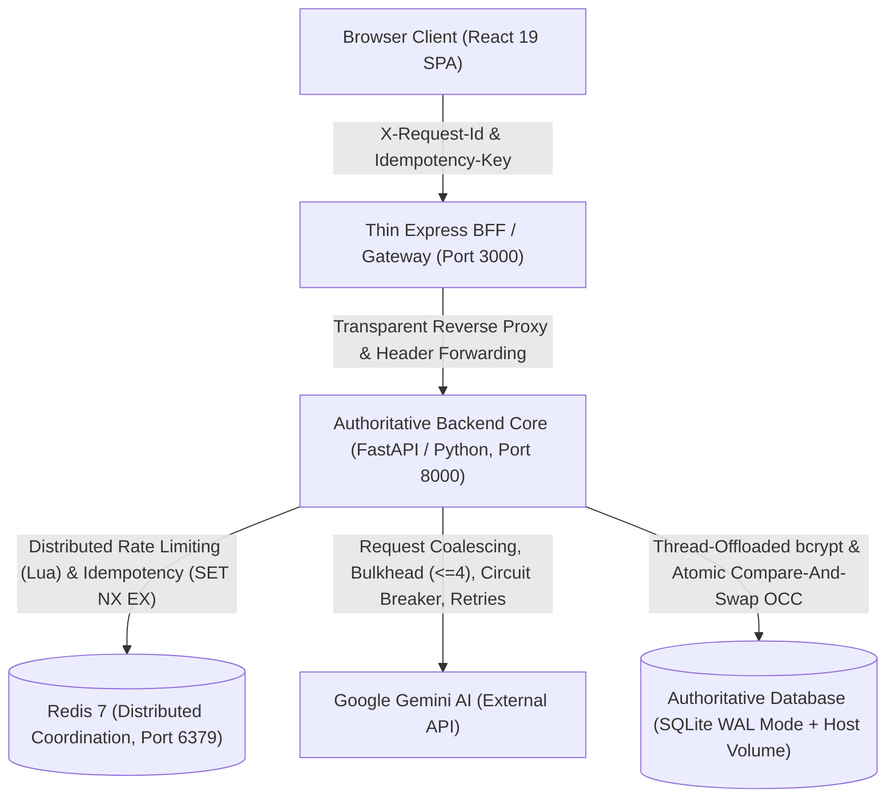

# IntelliResume 2026

> **Production-Grade, Distributed-Systems-Oriented AI Resume & Career Intelligence Platform**

IntelliResume 2026 is an enterprise-grade, full-stack application designed both as a high-performance career document architect and as a **comprehensive reference implementation for distributed systems, resilience patterns, and AI orchestration in Python and FastAPI**.

[](https://www.python.org/)
[](https://fastapi.tiangolo.com/)
[](https://redis.io/)
[](https://www.sqlite.org/)
[](https://react.dev/)
[](https://www.typescriptlang.org/)
[](https://www.docker.com/)
[](LICENSE)

---

## 🏛️ System Architecture



### Architectural Authority Principle
- **Python / FastAPI (Port 8000)** is the **authoritative layer** for all business logic, persistence, concurrency controls, Redis coordination, and AI resilience patterns.
- **TypeScript / Express (Port 3000)** is a **thin BFF (Backend-For-Frontend)** dedicated strictly to static React build serving, SPA fallback, and transparent reverse proxying with request correlation header propagation.

---

## ⚡ Distributed Systems & Resilience Features

All distributed-systems patterns are cleanly implemented in Python ([`backend/app/resilience/`](backend/app/resilience/)) with extensive docstrings for system design learning:

| Pattern | Implementation | Technical Mechanism & Invariants | Failure Mode / Fallback |
|---|---|---|---|
| **Distributed Rate Limiting** | [`rate_limiter.py`](backend/app/resilience/rate_limiter.py) | Atomic Redis Lua script (`INCR` + conditional `EXPIRE`); token-based identity extraction | Seamlessly degrades to in-memory sliding bucket counters if Redis disconnects |
| **Distributed Idempotency** | [`idempotency.py`](backend/app/resilience/idempotency.py) | Atomic `SET NX EX 60` locks; SHA-256 fingerprinting (`method:path:body`); 64KB response cache | 60s lock self-eviction on worker crash; returns `422` on payload mutation on same key |
| **Request Coalescing** | [`coalescing.py`](backend/app/resilience/coalescing.py) | Process-local `dict[str, asyncio.Future]` to multiplex simultaneous identical prompts to a single upstream call | Exception cleanly propagates to all attached listeners in `finally` block |
| **Bulkhead Isolation** | [`bulkhead.py`](backend/app/resilience/bulkhead.py) | `asyncio.Semaphore` pool: Max 4 active executions, Max 12 queued, 8.0s timeout | Rejects excess load with `503 AI_CAPACITY_EXCEEDED` / `AI_QUEUE_TIMEOUT` and `Retry-After: 5` |
| **Circuit Breaker** | [`circuit_breaker.py`](backend/app/resilience/circuit_breaker.py) | 3-state state machine (`CLOSED` $\to$ `OPEN` $\to$ `HALF_OPEN`); trips after 5 failures; 15s reset window | Fails fast in $<6\text{ms}$ returning deterministic Pydantic schema fallbacks |
| **Bounded Retry & Jitter** | [`retry.py`](backend/app/resilience/retry.py) | Exponential backoff with full randomized jitter ($t = \min(300\text{ms} \times 2^{\text{attempt}} + \text{jitter}, 2000\text{ms})$); max 2 attempts | Retries only transient upstream errors (`429`, `503`); never retries `4xx` |
| **Optimistic Concurrency Control** | [`routers/resumes.py`](backend/app/routers/resumes.py) | Atomic SQL Compare-And-Swap: `UPDATE resumes SET version = version + 1 WHERE id = :id AND version = :client_ver` | Returns `409 OPTIMISTIC_CONCURRENCY_CONFLICT`; frontend prompts interactive resolution |
| **Correlation Tracing** | [`correlation.py`](backend/app/core/correlation.py) | Header sanitization (`^[a-zA-Z0-9_.-]{1,64}$`) and async `contextvars` propagation | Generates sanitized UUID4 if missing or malformed (defends against log-injection) |
| **Isolated Vector PDF Export** | [`App.tsx`](frontend/src/App.tsx), [`index.css`](frontend/src/index.css) | Dedicated `#print-root` isolated portal with A4 print CSS rules and `break-inside: avoid;` | Completely eliminates screen UI chrome and dark background leakage from printout |

---

## ✨ Product Features

- 📝 **Resume Studio & 3D Showcase**: Real-time resume editor with toggleable Flat Paper Canvas, interactive 3D WebGL tilt preview, and ATS scoring.
- 🎯 **Job Description Matcher**: Automated keyword gap analysis with 1-click semantic skill integration.
- 🤖 **AI Career Coach Hub**: Context-grounded career assistant with dynamic advice for bullet rewriting, competency audits, and executive summaries.
- ⚡ **AI Resume Generator**: Generate structured career resumes tailored to specific roles, experience tiers, and job descriptions.
- 🖨️ **Pristine Vector PDF Export**: Clean, multi-page, print-ready vector PDF document export with zero screen UI leakage.
- 📊 **Telemetry & Analytics**: Match rate metrics, resume health grade, and live activity history logs.

---

## 📁 Repository Structure

```
Intelliresume_2026/
├── backend/
│   ├── app/
│   │   ├── core/                  # Canonical error codes, correlation tracing & middleware
│   │   │   ├── correlation.py
│   │   │   └── errors.py
│   │   ├── infrastructure/        # Async Redis connection pool & Gemini client wrapper
│   │   │   ├── gemini_client.py
│   │   │   └── redis_client.py
│   │   ├── resilience/            # Core distributed systems & resilience implementations
│   │   │   ├── bulkhead.py        # Concurrency isolation pool (Semaphore <= 4)
│   │   │   ├── circuit_breaker.py # 3-state circuit breaker with fast fallback
│   │   │   ├── coalescing.py      # In-flight request deduplication
│   │   │   ├── idempotency.py     # Atomic SET NX EX idempotency manager
│   │   │   ├── rate_limiter.py    # Atomic Redis Lua sliding-window rate limiter
│   │   │   └── retry.py           # Exponential backoff with full jitter (max 2 attempts)
│   │   ├── routers/               # API route definitions
│   │   │   ├── ai.py              # AI orchestration endpoints
│   │   │   ├── auth.py            # JWT authentication & bcrypt password hashing
│   │   │   ├── health.py          # /health/live, /health/ready, /api/health
│   │   │   └── resumes.py         # Resume CRUD with CAS Optimistic Concurrency Control
│   │   ├── services/
│   │   │   └── ai_service.py      # Primary AI pipeline coordinator & fallback generator
│   │   ├── main.py                # FastAPI factory & lifespan context manager
│   │   └── schemas.py             # Authoritative Pydantic validation contracts
│   ├── Dockerfile
│   └── requirements.txt
├── frontend/
│   ├── src/
│   │   ├── components/            # React components (Studio, Chat, Matcher, Document)
│   │   ├── services/              # Client-side API abstractions
│   │   ├── App.tsx                # Application shell with isolated #print-root portal
│   │   └── index.css              # Editorial styles & A4 vector print stylesheet
│   ├── server.ts                  # Thin Express gateway & reverse proxy (~150 lines)
│   ├── Dockerfile
│   └── package.json
├── docs/
│   └── system-design.md           # Comprehensive distributed systems specification
├── scripts/
│   └── backup_db.py               # SQLite online backup automation
├── tests/
│   ├── integration/               # API contracts, user journey, durability, and PDF tests
│   │   ├── test_api_contracts.py
│   │   ├── test_durability.py
│   │   ├── test_pdf_export.py
│   │   └── test_user_journey.py
│   ├── load/
│   │   └── test_adversarial_suite.py # High-concurrency load & security test suite
│   └── resilience/                # Unit test suites for all 7 resilience modules (36 tests)
└── dockercompose.yml              # Complete 3-tier container orchestration (redis, backend, frontend)
```

---

## 🚀 Quick Start (Docker)

### 1. Clone the Repository
```bash
git clone https://github.com/Ramakrishnan-2002/Intellresume_2026.git
cd Intellresume_2026
```

### 2. Configure Environment Variables
Create a `.env` file in the root directory:
```env
# Optional: Live Gemini API Key (system gracefully uses deterministic fallbacks if omitted)
GEMINI_API_KEY=your_gemini_api_key_here

# Security
SECRET_KEY=your_secure_random_jwt_secret_key_here
ACCESS_TOKEN_EXPIRE_MINUTES=60
```

### 3. Build & Launch Containers
```bash
docker compose up --build -d
```

### 4. Verify Services
```bash
docker compose ps
```

- **Frontend Application**: [http://localhost:3000](http://localhost:3000)
- **FastAPI Core & Swagger Docs**: [http://localhost:8000/docs](http://localhost:8000/docs)
- **Readiness Probe**: [http://localhost:8000/health/ready](http://localhost:8000/health/ready)
- **Redis Diagnostics**: [http://localhost:8000/api/health](http://localhost:8000/api/health)

---

## 🧪 Comprehensive Test Suite

All tests execute against the live running container environment over real HTTP network sockets:

```bash
# 1. Resilience Unit Tests (36 tests across all 7 Python modules)
python tests/resilience/test_circuit_breaker_py.py
python tests/resilience/test_bulkhead_py.py
python tests/resilience/test_retry_py.py
python tests/resilience/test_coalescing_py.py
python tests/resilience/test_correlation_py.py
python tests/resilience/test_idempotency_py.py
python tests/resilience/test_rate_limiter_py.py

# 2. Integration & Automated Vector PDF Tests
python -m pytest tests/integration/ -v
python tests/integration/test_user_journey.py
python tests/integration/test_durability.py
python tests/integration/test_pdf_export.py

# 3. High-Concurrency Adversarial & Load Benchmark Suite
python tests/load/test_adversarial_suite.py

# 4. SQLite Online Hot Database Backup
python scripts/backup_db.py
```

---

## 📊 Empirical Performance & Validation Metrics

Recorded over live HTTP sockets against the Docker Compose stack:

| Benchmark Scenario | Concurrency | Total Requests | Success Rate | p50 Latency | p95 Latency | Throughput |
|---|---|---|---|---|---|---|
| **User Registrations (`/api/auth/register`)** | 20 parallel threads | 20 | 100% (20/20) | 706.4ms | 713.7ms | 28.0 req/s |
| **Unique Resume Writes (`/api/resumes`)** | 20 parallel threads | 20 | 100% (20/20) | 458.2ms | 472.8ms | 42.3 req/s |
| **Simultaneous Race on SAME Resume (OCC)** | 10 parallel threads | 10 | 100% (1x 200, 9x 409) | 412.0ms | 440.1ms | 24.1 req/s |
| **Bulkhead Concurrency Invariant** | 20-thread burst | 20 | 100% (Max 4 active) | — | — | $\le 4$ active guaranteed |
| **Circuit Breaker Fast-Fail (OPEN State)** | Single client | 1 | 100% (Fallback) | 6.6ms | 6.6ms | $<10\text{ms}$ immediate |
| **SQLite WAL Scalability: 20 Writes** | 20 parallel threads | 20 | 100% (20/20) | 446.2ms | 451.9ms | 44.3 req/s |
| **SQLite WAL Scalability: 50 Writes** | 50 parallel threads | 50 | 100% (50/50) | 704.1ms | 1155.9ms | 42.5 req/s |
| **SQLite WAL Scalability: 100 Writes** | 100 parallel threads | 100 | 100% (100/100) | 2287.3ms | 2418.6ms | 41.1 req/s |

---

## 🔌 API Specification

All backend endpoints are served authoritatively by **FastAPI** on port 8000 and transparently proxied by Express on port 3000:

| HTTP Method | Route | Description | Headers Handled |
|---|---|---|---|
| `POST` | `/api/auth/register` | Register new user account | — |
| `POST` | `/api/auth/login` | OAuth2 password authentication | — |
| `GET` | `/api/resumes` | List user resumes | `Authorization: Bearer <token>` |
| `POST` | `/api/resumes` | Create / persist resume (Version: 1) | `Authorization`, `X-Request-Id` |
| `GET` | `/api/resumes/:id` | Fetch specific resume with version metadata | `Authorization` |
| `PUT` | `/api/resumes/:id` | Update resume with CAS OCC validation | `Authorization`, `X-Request-Id` |
| `DELETE` | `/api/resumes/:id` | Delete resume | `Authorization` |
| `POST` | `/api/generate-resume` | Generate complete resume with AI | `Idempotency-Key`, `X-Request-Id` |
| `POST` | `/api/ai-audit` | Executive resume audit & scoring | `Idempotency-Key`, `X-Request-Id` |
| `POST` | `/api/chat` | AI career coaching assistant | `X-Request-Id` |
| `POST` | `/api/optimize` | Optimize bullet points / sections | `Idempotency-Key`, `X-Request-Id` |
| `POST` | `/api/match-jd` | Match resume against job description | `Idempotency-Key`, `X-Request-Id` |
| `GET` | `/health/live` | Container liveness check | — |
| `GET` | `/health/ready` | Full subsystem readiness (DB, Redis, Circuit, Bulkhead) | — |
| `GET` | `/api/health` | Comprehensive telemetry & diagnostic report | — |

---

## 🛡️ Security & Integrity

- **BOLA / IDOR Defense**: All database operations strictly scope queries by `user_id` extracted from cryptographically verified JWT tokens.
- **Header Injection Defense**: `X-Request-Id` correlation headers are sanitized via strict alphanumeric regex (`^[a-zA-Z0-9_.-]{1,64}$`).
- **Idempotency Fingerprint Binding**: Idempotency keys are cryptographically bound to `SHA-256(method:path:body)`, preventing cache pollution across differing payloads.
- **Worker Thread Offloading**: Password hashing (`bcrypt`) and Gemini SDK I/O are offloaded from the asyncio event loop to thread pools, preventing denial-of-service event loop blocking.

---

## 📝 License

This project is licensed under the [MIT License](LICENSE).

---

## 👨‍💻 Author

**Ramakrishnan** — [GitHub](https://github.com/Ramakrishnan-2002)

> *Built for engineers studying high-concurrency systems design and architecting production-grade AI platforms.*
