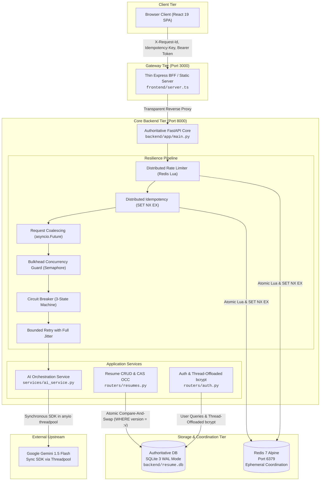
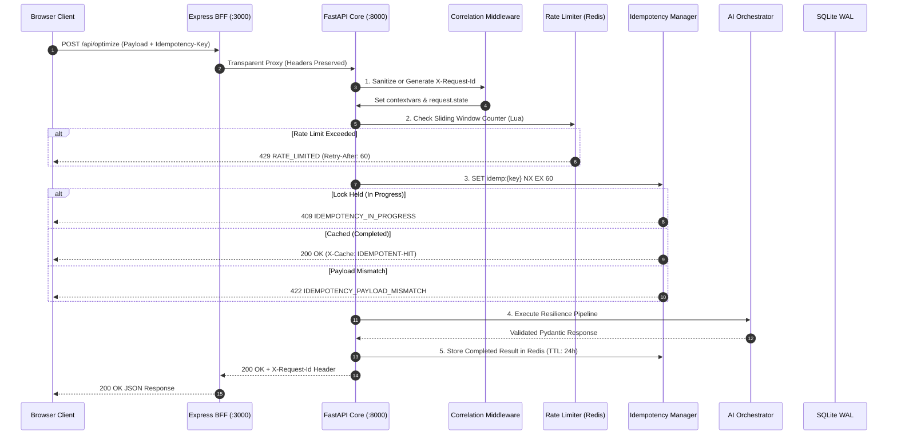
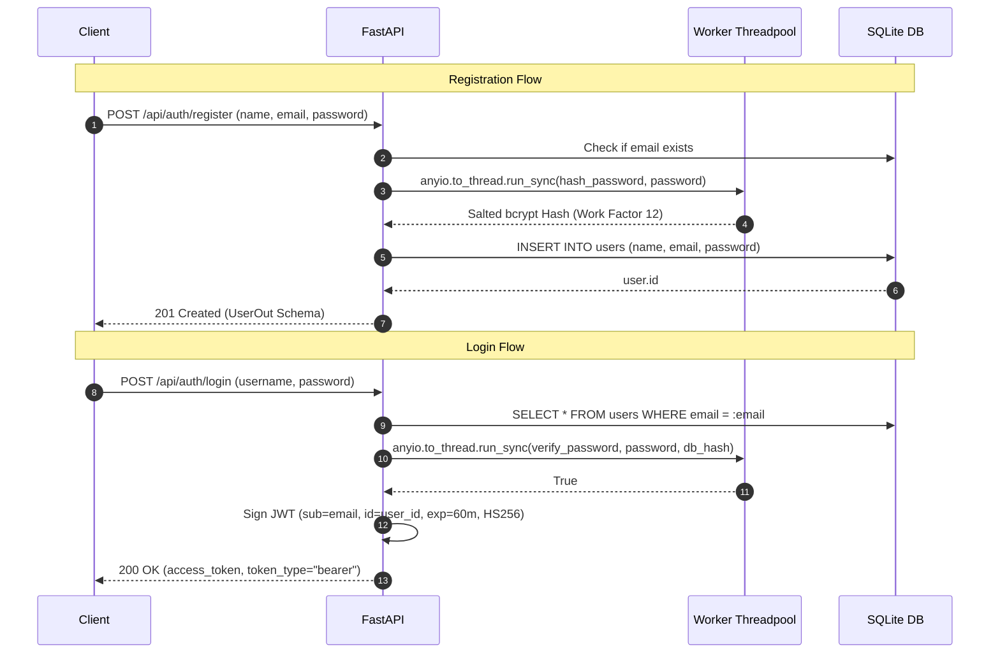
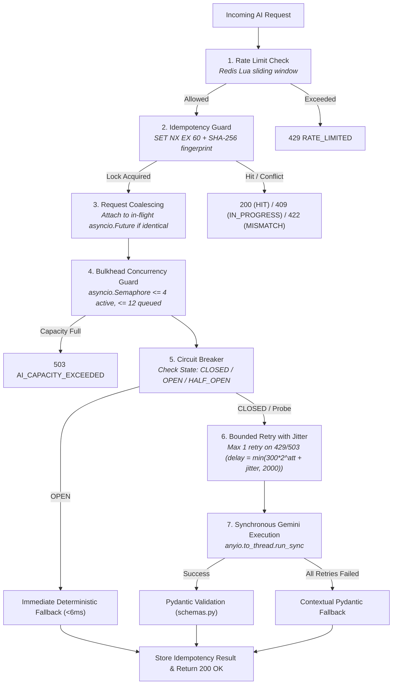
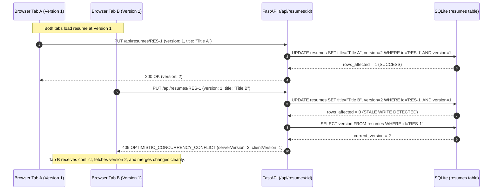
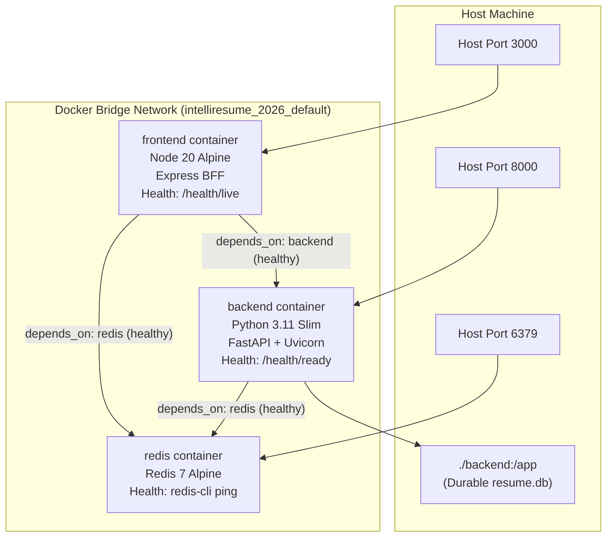

# IntelliResume 2026 — Backend Architecture & System Blueprint

> **Verified Technical Architecture, Component Boundaries, Database Schemas, and Execution Flows**
> Derived directly from the executable implementation in `backend/app/`, `dockercompose.yml`, and `frontend/server.ts`.

---

## 1. High-Level Architecture Topology



---

## 2. The Single Implementation Principle

To eliminate dual-stack maintenance overhead and keep Python as the single authoritative backend language, responsibilities are strictly partitioned:

| Subsystem / Concern | Authoritative Owner | Implementation Path | Explicitly Excluded from Express BFF |
|---|---|---|---|
| **API Contracts & Routing** | **Python / FastAPI** | `backend/app/routers/*` | Express never defines business routes or schema parsing. |
| **Validation Engine** | **Python / Pydantic v2** | `backend/app/schemas.py` | Express performs zero request/response validation. |
| **Distributed Rate Limiting** | **Python + Redis** | `backend/app/resilience/rate_limiter.py` | `ioredis` completely removed from Express `package.json`. |
| **Distributed Idempotency** | **Python + Redis** | `backend/app/resilience/idempotency.py` | Express forwards `Idempotency-Key` without state tracking. |
| **Request Coalescing** | **Python (Process)** | `backend/app/resilience/coalescing.py` | No in-flight promise caching in Express. |
| **Bulkhead Isolation** | **Python (Process)** | `backend/app/resilience/bulkhead.py` | No concurrency limits in Express. |
| **Circuit Breaker** | **Python (Process)** | `backend/app/resilience/circuit_breaker.py` | Express does not monitor upstream Gemini failures. |
| **AI Orchestration & Fallback** | **Python** | `backend/app/services/ai_service.py` | `@google/genai` completely removed from frontend dependencies. |
| **Persistence & OCC** | **Python + SQLite** | `backend/app/routers/resumes.py` | Database file is accessed exclusively by FastAPI. |
| **Authentication & Password Hashing** | **Python** | `backend/app/routers/auth.py`, `OAuth2.py` | Express handles zero credentials or JWT decoding. |
| **Correlation ID Sanitization** | **Python** | `backend/app/core/correlation.py` | Express simply echoes incoming headers or proxies. |
| **Static SPA Serving & Proxy** | **TypeScript / Express** | `frontend/server.ts` | Serves compiled React assets, handles SPA fallback, and proxies `/api/*` to `:8000`. |

---

## 3. Database Schema & Data Modeling

The authoritative relational database is SQLite 3 executing in Write-Ahead Logging (`WAL`) mode via SQLAlchemy ORM.

### 3.1 Table Definitions

#### `users` Table
Stores user credentials and profile metadata.
```sql
CREATE TABLE users (
    id INTEGER PRIMARY KEY AUTOINCREMENT,
    email VARCHAR NOT NULL UNIQUE,
    password VARCHAR NOT NULL,
    name VARCHAR NOT NULL,
    created_at TIMESTAMP WITH TIME ZONE DEFAULT CURRENT_TIMESTAMP NOT NULL
);
CREATE INDEX ix_users_id ON users (id);
CREATE UNIQUE INDEX ix_users_email ON users (email);
```

#### `resumes` Table
Stores structured resume JSON documents with Optimistic Concurrency Control (`OCC`) versioning.
```sql
CREATE TABLE resumes (
    id INTEGER PRIMARY KEY AUTOINCREMENT,
    user_id INTEGER NOT NULL,
    resume_id VARCHAR NOT NULL,
    title VARCHAR NOT NULL,
    status VARCHAR DEFAULT 'DRAFT' NOT NULL,
    data TEXT NOT NULL,
    version INTEGER DEFAULT 1 NOT NULL,
    created_at TIMESTAMP WITH TIME ZONE DEFAULT CURRENT_TIMESTAMP NOT NULL,
    updated_at TIMESTAMP WITH TIME ZONE DEFAULT CURRENT_TIMESTAMP NOT NULL
);
CREATE INDEX ix_resumes_id ON resumes (id);
CREATE INDEX ix_resumes_user_id ON resumes (user_id);
CREATE INDEX ix_resumes_resume_id ON resumes (resume_id);
```

### 3.2 SQLAlchemy Domain Model Mapping
- **`User`** (`backend/app/models.py`): Maps to `users`. Password stored as 60-character bcrypt hash string.
- **`Resume`** (`backend/app/models.py`): Maps to `resumes`. The `data` column stores serialized JSON conforming to the `ResumeData` Pydantic model (`schemas.py`). The `version` column increments atomically on every successful write.

---

## 4. End-to-End Execution Flows

### 4.1 Complete Request Lifecycle & Middleware Pipeline



---

### 4.2 Authentication & Password Security Lifecycle



---

### 4.3 AI Resilience Pipeline

Every AI operation in `ai_service.py` executes through a strictly ordered 7-stage resilience chain:



---

### 4.4 Optimistic Concurrency Control (OCC) Write Conflict Flow



---

### 4.5 PDF Vector Export & Print Portal Flow

```mermaid
sequenceDiagram
    autonumber
    participant U as User
    participant R as React App (App.tsx)
    participant DOM as Browser DOM
    participant PE as Browser Print Engine

    U->>R: Click "Export PDF"
    R->>DOM: Mount isolated portal: <div id="print-root"><ResumeDocument data={resumeData} /></div>
    R->>PE: Trigger window.print()
    Note over PE,DOM: @media print stylesheet activates
    PE->>DOM: Hide <div id="screen-root"> (display: none !important)
    PE->>DOM: Hide navigation, toolbars, sidebars, buttons (.print:hidden)
    PE->>DOM: Display ONLY #print-root (display: block !important, bg: #ffffff)
    PE->>DOM: Apply A4 geometry: @page { size: A4 portrait; margin: 12mm 15mm; }
    PE->>DOM: Apply page-break isolation: break-inside: avoid on sections & articles
    PE-->>U: Pristine vector PDF preview with clean pagination & zero UI chrome
```

---

## 5. Docker Infrastructure & Networking Topology



### Healthcheck Diagnostics
- **Redis (`redis:7-alpine`)**: `redis-cli ping` every 5s.
- **Backend (`python:3.11-slim`)**: `urlopen('http://localhost:8000/health/ready')` every 10s. Verifies SQLite connectivity, Redis reachability, Circuit Breaker state, and Bulkhead queue metrics.
- **Frontend (`node:20-alpine`)**: HTTP GET on `http://localhost:3000/health/live` every 10s.
