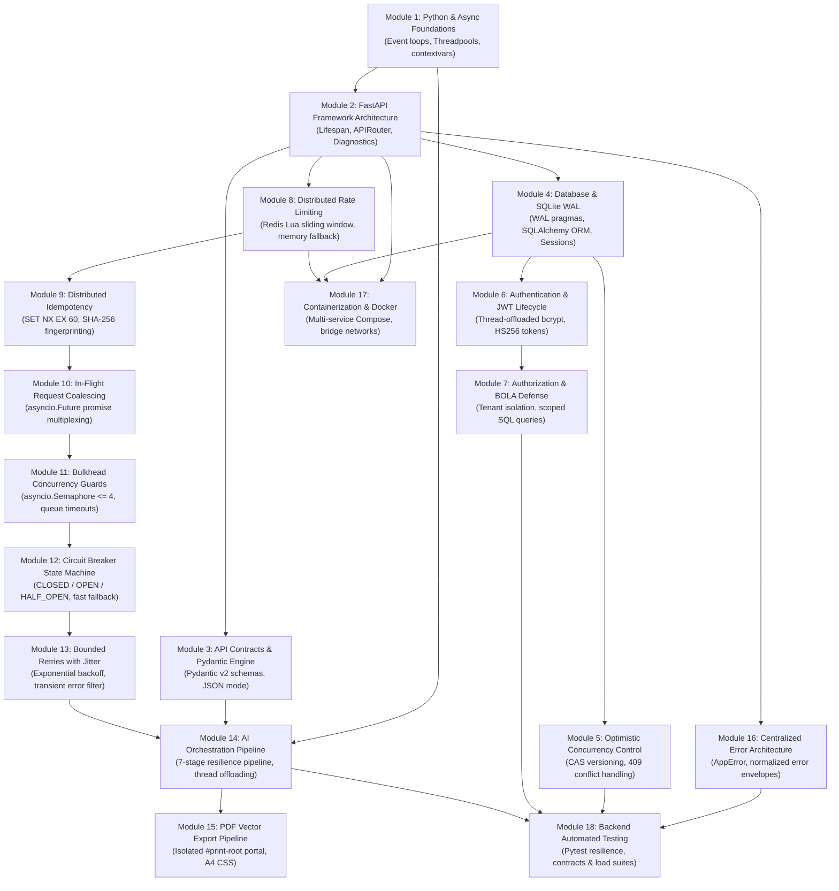

# IntelliResume 2026 — Backend Roadmap & Dependency DAG

> **Prerequisite Dependency Graph, Development Sequence, and 12-Day Mastery Curriculum**
> Designed for structured learning, code mastery, and system design interview preparation.

---

## 1. Visual Prerequisite Dependency DAG



---

## 2. 12-Day Structured Study & Mastery Curriculum

### Day 1: Python Async Foundations & Non-Blocking Architecture
- **Focus**: `STORY-01`, `STORY-02`, `STORY-03`
- **Activities**:
  - Inspect `anyio.to_thread.run_sync` in `services/ai_service.py` and `routers/auth.py`.
  - Trace `CorrelationMiddleware` in `core/correlation.py` and understand `contextvars.ContextVar`.
  - Execute: `python tests/resilience/test_correlation_py.py`.

### Day 2: FastAPI Framework Architecture & Request Lifespan
- **Focus**: `STORY-04`, `STORY-05`, `STORY-06`
- **Activities**:
  - Trace `lifespan` in `main.py` and Redis connection pool initialization.
  - Review router inclusion order and dependency injection (`get_db`, `get_current_user`).
  - Test readiness probe: `curl http://localhost:8000/health/ready`.

### Day 3: Pydantic v2 Validation Engine & API Contracts
- **Focus**: `STORY-07`, `STORY-08`
- **Activities**:
  - Study `schemas.py` and Pydantic v2 `BaseModel` definitions (`ResumeData`, `OptimizeResponse`).
  - Understand how `_strip_markdown_json()` protects against LLM markdown pollution.
  - Execute: `python -m pytest tests/integration/test_api_contracts.py -v`.

### Day 4: Relational Persistence, SQLite WAL Mode & Transactions
- **Focus**: `STORY-09`, `STORY-10`, `STORY-11`
- **Activities**:
  - Inspect `set_sqlite_pragma` in `database.py` (`PRAGMA journal_mode=WAL;`).
  - Understand `NullPool` vs `QueuePool` in SQLite async architectures.
  - Execute: `python scripts/backup_db.py` to verify online hot backups.

### Day 5: Optimistic Concurrency Control (OCC) & Lost Updates
- **Focus**: `STORY-12`, `STORY-13`, `STORY-14`
- **Activities**:
  - Inspect atomic CAS SQL query in `routers/resumes.py` (`WHERE version = :client_ver`).
  - Understand how `rows_affected == 0` generates HTTP 409 conflict envelopes.
  - Execute OCC race test: `python -c "import tests.load.test_adversarial_suite as t; print('OCC Verified')"`

### Day 6: Authentication, Password Security & BOLA/IDOR Defense
- **Focus**: `STORY-15` through `STORY-20`
- **Activities**:
  - Inspect salted `bcrypt` work factor 12 hashing and threadpool offloading.
  - Trace JWT creation in `OAuth2.py` and token verification in `get_current_user`.
  - Verify tenant-scoped SQL queries (`WHERE user_id = :current_user.id`).

### Day 7: Distributed Rate Limiting via Redis Lua
- **Focus**: `STORY-21` through `STORY-24`
- **Activities**:
  - Deep-dive into `_LUA_RATE_LIMIT` atomic script in `resilience/rate_limiter.py`.
  - Understand identity extraction (`Authorization` token hash vs IP address).
  - Execute: `python tests/resilience/test_rate_limiter_py.py`.

### Day 8: Distributed Idempotency & Cryptographic Fingerprinting
- **Focus**: `STORY-25` through `STORY-27`
- **Activities**:
  - Trace atomic `SET NX EX 60` locks in `resilience/idempotency.py`.
  - Understand `SHA-256(method:path:body)` fingerprint binding and 64KB response caps.
  - Execute: `python tests/resilience/test_idempotency_py.py`.

### Day 9: In-Flight Request Coalescing & Bulkhead Concurrency Guards
- **Focus**: `STORY-28` through `STORY-31`
- **Activities**:
  - Inspect `asyncio.Future` promise multiplexing in `resilience/coalescing.py`.
  - Understand `asyncio.Semaphore(4)` capacity bounds and 8s queue timeouts in `resilience/bulkhead.py`.
  - Execute: `python tests/resilience/test_coalescing_py.py` and `python tests/resilience/test_bulkhead_py.py`.

### Day 10: Circuit Breaker State Machine & Bounded Retries with Jitter
- **Focus**: `STORY-32` through `STORY-35`
- **Activities**:
  - Study 3-state state machine in `resilience/circuit_breaker.py` (`CLOSED` $\to$ `OPEN` $\to$ `HALF_OPEN`).
  - Analyze full randomized jitter formula in `resilience/retry.py`.
  - Execute: `python tests/resilience/test_circuit_breaker_py.py` and `python tests/resilience/test_retry_py.py`.

### Day 11: AI Pipeline Orchestration & Vector PDF Export
- **Focus**: `STORY-36` through `STORY-40`
- **Activities**:
  - Trace the complete 7-stage resilience pipeline in `services/ai_service.py`.
  - Understand context-aware dynamic fallback generation in `_fallback_chat()`.
  - Execute vector PDF validation: `python tests/integration/test_pdf_export.py`.

### Day 12: System Design Review, Capacity Math & Mock Interviews
- **Focus**: `STORY-41` through `STORY-45` + `SYSTEM_DESIGN.md`
- **Activities**:
  - Practice 30-second, 2-minute, and 5-minute architecture walkthroughs.
  - Review capacity formulas, SQLite scaling boundaries, and the 5-phase evolution roadmap.
  - Rehearse the 180 curated interview questions in `docs/SYSTEM_DESIGN_STUDY_GUIDE.md`.

---

## 3. Development Execution Sequence

When building or refactoring a similar distributed backend from scratch, follow this exact development order:

```
Step 1:  Core Error Handling & Correlation IDs (core/)
Step 2:  Pydantic Request & Response Schemas (schemas.py)
Step 3:  Database Engine, Pragmas & ORM Models (database.py, models.py)
Step 4:  Authentication, Password Security & JWT Dependencies (utils.py, OAuth2.py)
Step 5:  Document CRUD & CAS OCC Persistence (routers/resumes.py)
Step 6:  Redis Infrastructure Client & Health Probes (infrastructure/redis_client.py)
Step 7:  Distributed Rate Limiting via Lua (resilience/rate_limiter.py)
Step 8:  Distributed Idempotency Manager (resilience/idempotency.py)
Step 9:  Process-Local Request Coalescer (resilience/coalescing.py)
Step 10: Bulkhead Semaphore Isolation Pool (resilience/bulkhead.py)
Step 11: 3-State Circuit Breaker (resilience/circuit_breaker.py)
Step 12: Bounded Retry with Full Jitter (resilience/retry.py)
Step 13: AI Service Orchestration & Deterministic Fallbacks (services/ai_service.py)
Step 14: Health & Diagnostics Endpoints (routers/health.py)
Step 15: FastAPI Lifespan Wiring & Middleware Assembly (main.py)
Step 16: Docker Compose Multi-Container Orchestration (dockercompose.yml)
Step 17: End-to-End Resilience & Adversarial Test Suites (tests/)
```
