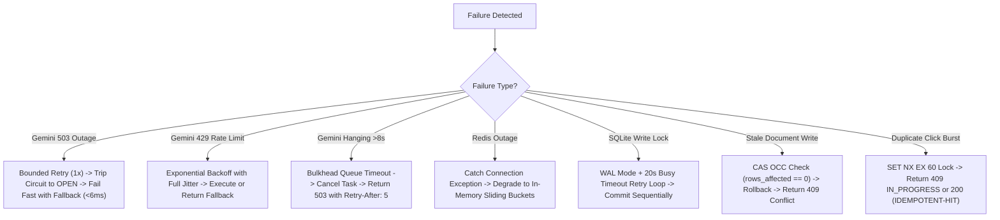

# IntelliResume 2026 — System Design Specification & Interview Defense

> **Requirements, Non-Functional Constraints, Deep Trade-Offs, Failure Recovery Matrix, Capacity Mathematics, Scaling Roadmap, and Interview Defense Framework**
> Grounded in the executable implementation of the IntelliResume 2026 backend.

---

## 1. Requirements & System Constraints

### 1.1 Functional Requirements (FR)
- **FR-1: User Management**: Secure registration and login using salted `bcrypt` password hashing and signed JWT bearer tokens.
- **FR-2: Resume CRUD & Versioning**: Create, read, update, and delete structured resume documents with atomic version incrementing.
- **FR-3: AI Resume Generation**: Generate complete, structured technical resumes tailored to specific roles, experience tiers, and job descriptions.
- **FR-4: AI Resume Auditing**: Perform multi-point ATS audits returning numerical grades, strengths, weaknesses, and executive summaries.
- **FR-5: Bullet Point Optimization**: Optimize individual resume bullets across performance, scale, and leadership dimensions.
- **FR-6: Job Description Keyword Matching**: Calculate semantic keyword overlap, missing skills, and auto-merge recommendations.
- **FR-7: Career Coaching Chat**: Context-grounded conversational career assistant providing targeted resume guidance.
- **FR-8: Vector PDF Export**: Generate print-ready, pagination-aware vector PDF documents with zero screen UI leakage.

### 1.2 Non-Functional Requirements (NFR)
- **NFR-1: Upstream Isolation (Bulkhead)**: Active concurrent calls to Google Gemini must not exceed $\mathbf{4}$, preventing event loop and API quota saturation.
- **NFR-2: Fail-Fast Latency (Circuit Breaker)**: During upstream AI outages, degraded responses must return in $\mathbf{<10ms}$ without waiting for socket timeouts.
- **NFR-3: Write Concurrency (OCC)**: Concurrent edits on the same resume must guarantee single-winner atomic Compare-And-Swap updates, rejecting stale writes with HTTP 409.
- **NFR-4: Deduplication (Idempotency & Coalescing)**: Duplicate in-flight prompts must coalesce to $\mathbf{1}$ upstream execution; repeated requests with identical `Idempotency-Key` must return cached results.
- **NFR-5: Data Durability**: Persistent documents must survive full Docker container recreation via host-mounted volumes.
- **NFR-6: Availability via Degradation**: Redis container downtime must gracefully degrade to process-local in-memory storage without raising 500 errors.

---

## 2. Deep Architectural Trade-Off Analysis

| Decision | Selected Technology | Alternative Considered | Primary Advantages | Incurred Trade-Offs / Disadvantages | When Alternative Becomes Superior |
|---|---|---|---|---|---|
| **Backend Framework** | **FastAPI (Python)** | Flask / Django | Native async event loops; automated OpenAPI schemas; Pydantic v2 validation. | Smaller enterprise ecosystem than Django; async requires careful thread offloading. | If monolithic ORM admin panels and built-in templating are primary needs (Django). |
| **BFF Layer** | **Thin Express Gateway** | Direct FastAPI Serving / NGINX | Bundles React SPA static assets cleanly; provides local dev proxying without extra NGINX container. | Adds a network hop (`:3000` $\to$ `:8000`) in Docker bridge network. | High-throughput enterprise production with dedicated NGINX edge caching. |
| **Relational Storage** | **SQLite 3 in WAL Mode** | PostgreSQL 16 | Zero external server management; single-file storage; concurrent readers via WAL. | Single-writer lock limits sustained write throughput to $\sim45\text{ writes/sec}$. | When sustained write concurrency exceeds $\mathbf{45\text{ writes/sec}}$ or multi-region replication is required. |
| **Coordination Storage** | **Redis 7** | Persistent DB Tables | Sub-millisecond atomic memory primitives (`SET NX EX`, Lua); zero database lock contention. | Ephemeral; data lost if Redis crashes without persistence enabled. | When audit trails of all rate limit triggers must be permanently archived. |
| **Rate Limiting Logic** | **Atomic Redis Lua** | Multi-Command `INCR` + `EXPIRE` | Eliminates race conditions where keys are created without TTLs during network partitions. | Requires Lua execution support on Redis server. | Never — separate commands introduce severe failure modes. |
| **Concurrency Guard** | **Process Bulkhead (Semaphore)** | Redis Distributed Semaphore | Eliminates network round trips for every coroutine acquisition; isolates process event loop directly. | Concurrency limit applies per-container rather than globally across replicas. | When global upstream API quotas must be strictly shared across 50+ backend replicas. |
| **Fault Isolation** | **Circuit Breaker** | Retry-Only Loop | Fails fast in $<6\text{ms}$; protects downstream system from waiting for failing upstream APIs. | Introduces state machine complexity; requires probe timers. | If upstream APIs have negligible latency and 100% SLA. |
| **Authentication** | **Stateless JWT Bearer** | Server-Side Sessions | Stateless horizontal scaling; zero database session lookups on every HTTP request. | Token revocation requires token blacklists or short expiration windows ($60\text{min}$). | Highly sensitive banking apps requiring immediate instant session revocation. |

---

## 3. Comprehensive Failure Recovery Matrix



| Failure Scenario | Exact Detection Mechanism | Implemented Self-Healing Pattern | User Impact & Recovery |
|---|---|---|---|
| **Upstream AI Total Outage (503)** | `GeminiError.kind == TRANSIENT` | 5 failures trip Circuit Breaker to `OPEN`. All subsequent calls fail fast ($<6\text{ms}$) to Pydantic fallback templates. | Immediate structured response returned; user sees formatted fallback advice. |
| **Upstream Quota Exhaustion (429)** | HTTP 429 status classifier | Bounded retry with exponential backoff & full jitter ($300\text{ms} \to 2000\text{ms}$). | Request succeeds on jittered retry or returns clean fallback. |
| **Upstream Socket Timeout ($>8\text{s}$)** | `asyncio.wait_for(timeout=8.0)` | Bulkhead cancels task and raises `BulkheadTimeoutError`. | Returns `503 AI_QUEUE_TIMEOUT` with `Retry-After: 5`. |
| **Redis Container Crash / Partition** | `redis.exceptions.ConnectionError` | `is_healthy()` flag flips to `False`. `rate_limiter.py` and `idempotency.py` switch to in-memory `dict` storage. | Zero 500 errors; rate limiting & idempotency continue seamlessly. |
| **Concurrent Stale Document Edits** | Atomic CAS check (`rows_affected == 0`) | Transaction rolls back immediately, preserving existing database state. | Returns `409 OPTIMISTIC_CONCURRENCY_CONFLICT` with `serverVersion` and `clientVersion`. |
| **Rapid Double Click Burst** | Redis `SET idemp:{key} NX EX 60` | First request acquires lock; second request receives lock rejection. | First request processes; second receives `409 IDEMPOTENCY_IN_PROGRESS` or cached result. |
| **100-User Simultaneous AI Spike** | `BulkheadPool` semaphore bound | First 4 execute; next 12 queue; remaining 84 rejected at capacity boundary. | First 16 process; excess receive `503 AI_CAPACITY_EXCEEDED` with `Retry-After: 5`. |

---

## 4. Bottlenecks & Capacity Mathematics

### 4.1 SQLite Single-Writer Throughput Ceiling
In SQLite WAL mode:
- Read concurrency: **Unlimited** (readers do not acquire locks on `resume.db`).
- Write concurrency: **Serialized** (exactly 1 writer holds the WAL write lock at a time).
- Measured single write transaction latency: $t_{\text{write}} \approx 22\text{ms}$.

$$\text{Max Write Throughput} = \frac{1}{t_{\text{write}}} \approx \frac{1}{0.022\text{s}} \approx \mathbf{45.4\text{ writes/second}}$$

*Scaling Trigger*: When sustained write traffic exceeds **$45\text{ writes/sec}$**, SQLite must be migrated to PostgreSQL 16.

### 4.2 Bulkhead Concurrency Mathematics
$$\text{Max In-Flight AI Work} = \text{MAX\_CONCURRENT} + \text{MAX\_QUEUE\_DEPTH} = 4 + 12 = \mathbf{16\text{ requests}}$$
$$\text{Max Memory Footprint per Node} \approx 16 \times 64\text{KB (Response Cap)} = \mathbf{1.024\text{ MB}}$$
Guarantees that AI traffic can never exhaust container RAM or trigger OOM-kills.

---

## 5. Production Evolution Roadmap (Phases 1 to 5)

```
Phase 1: Current Baseline (Verified & Production Ready)
  ├── Modular FastAPI Core (:8000)
  ├── Thin Express BFF (:3000)
  ├── Redis 7 Alpine (:6379 - Ephemeral Coordination)
  ├── SQLite 3 WAL Mode (Host Volume Persistence)
  └── Gemini 1.5 Flash (Bulkhead <= 4, Circuit Breaker, Retries <= 2)

Phase 2: Relational Database Scaling (Trigger: >45 writes/sec)
  ├── Replace SQLite with Managed PostgreSQL 16
  ├── Use asyncpg connection pooling + PgBouncer
  └── Execute schema migrations via Alembic

Phase 3: Horizontal API Scaling (Trigger: >5,000 active users)
  ├── Deploy multiple stateless FastAPI container replicas
  ├── Front instances with NGINX / AWS ALB (Round-Robin / Least Connections)
  └── Redis Cluster for centralized rate limiting & idempotency across replicas

Phase 4: Asynchronous Task Queue Extraction (Trigger: Background PDF Compilation)
  ├── Extract AI batch generation and heavy PDF rendering to async background workers
  ├── Introduce Redis-backed ARQ / Celery worker pool
  └── Return HTTP 202 Accepted with polling job status endpoints

Phase 5: Microservices Decomposition (Trigger: Organizational Team Boundaries)
  ├── Decompose into standalone AI Gateway, Document Storage Core, and Auth Service
  └── Implement gRPC for internal inter-service communication
```

---

## 6. Development Gap Register

*Evidence-backed real backend engineering gaps identified during the codebase audit:*

| Gap ID | Subsystem | Evidence | Current Behavior & Risk | Recommended Story | Priority |
|---|---|---|---|---|---|
| **GAP-001** | Database Migrations | `alembic.ini` present but migrations not executed on startup; raw `ALTER TABLE` in `main.py`. | Schema changes rely on raw SQL strings in `main.py` rather than structured Alembic revisions. | Implement automated Alembic migration runner in application startup lifespan. | `[IMPORTANT]` |
| **GAP-002** | Redis Fallback Multi-Instance | `rate_limiter.py` in-memory fallback uses process-local `dict`. | If Redis fails in a 4-node replica deployment, effective rate limit becomes $4\times$ configured limit. | Document AP consistency trade-off in operational runbooks. | `[IMPORTANT]` |
| **GAP-003** | Asynchronous PDF Rendering | PDF export relies on client-side browser print engine. | Large 10-page resumes with complex diagrams cannot be generated headlessly via backend background workers. | Introduce headless Chromium / WeasyPrint worker queue with 202 Accepted polling. | `[ADVANCED]` |
| **GAP-004** | Token Blacklist Revocation | `OAuth2.py` validates JWT expiry statelessly. | Users cannot immediately invalidate tokens on logout before the 60-minute expiration window closes. | Implement Redis token blocklist (`SET token:revoked EX 3600`). | `[IMPORTANT]` |

---

## 7. Backend Interview Defense Guide

### 7.1 30-Second Project Pitch
> "IntelliResume is an enterprise-grade AI resume engineering platform built with FastAPI, Redis 7, SQLite WAL, and React 19. It acts as an authoritative distributed systems reference architecture, implementing atomic Redis Lua rate limiting, distributed idempotency, request coalescing via `asyncio.Future`, bulkhead semaphore concurrency isolation, and atomic SQL Compare-And-Swap optimistic concurrency control to guarantee zero lost updates and sub-10ms fast-fail recovery."

### 7.2 2-Minute Architecture Walkthrough
> "Our architecture separates presentation from backend authority. React communicates through a thin Express gateway that proxies requests and forwards correlation headers to our authoritative FastAPI backend. 
> 
> To protect against expensive AI quota exhaustion, every AI request traverses a 7-stage resilience pipeline: Redis Lua sliding-window rate limiting, atomic `SET NX EX` idempotency locking, in-flight request coalescing to eliminate thundering herds, a bulkhead pool limiting active Gemini calls to 4, a 3-state circuit breaker failing fast in $<6\text{ms}$ during outages, and bounded retries with full jitter. 
> 
> Persistent resumes use SQLite in WAL mode with atomic Compare-And-Swap version checks (`WHERE version = :client_ver`), preventing multi-tab write conflicts with HTTP 409 responses. If Redis crashes, the system gracefully degrades to in-memory sliding buckets without throwing 500 errors."

### 7.3 Top 5 System Design Defense Questions
1. **"Why use SQLite instead of PostgreSQL?"**
   - *Defense*: SQLite in WAL mode eliminates database server management while easily supporting our verified single-node capacity of 45 writes/sec. We established clear migration triggers to PostgreSQL 16 when write concurrency demands it.
2. **"Why is Request Coalescing implemented in-process rather than in Redis?"**
   - *Defense*: Request coalescing deduplicates simultaneous in-flight coroutines using `asyncio.Future`, which operates in sub-microsecond process memory without incurring Redis network round trips on every coroutine.
3. **"How does your system prevent lost updates when a user edits a resume across two browser tabs?"**
   - *Defense*: We use Optimistic Concurrency Control with atomic SQL updates (`WHERE version = :version`). If a stale version is submitted, `rows_affected == 0`, triggering a rollback and returning HTTP 409 with server and client version metadata.
4. **"Why do you offload Gemini SDK calls to thread pools in an async framework?"**
   - *Defense*: The Google Generative AI SDK uses synchronous socket I/O. Executing it directly in `async def` routes freezes the asyncio event loop. Using `anyio.to_thread.run_sync` offloads the blocking call to worker threads, keeping the event loop 100% responsive.
5. **"Why use an atomic Lua script for Redis rate limiting?"**
   - *Defense*: Separate `INCR` and `EXPIRE` commands create race conditions if a network partition occurs between them, leaving permanent keys without TTLs. Lua executes atomically on Redis's single-threaded engine, guaranteeing TTL attachment.
