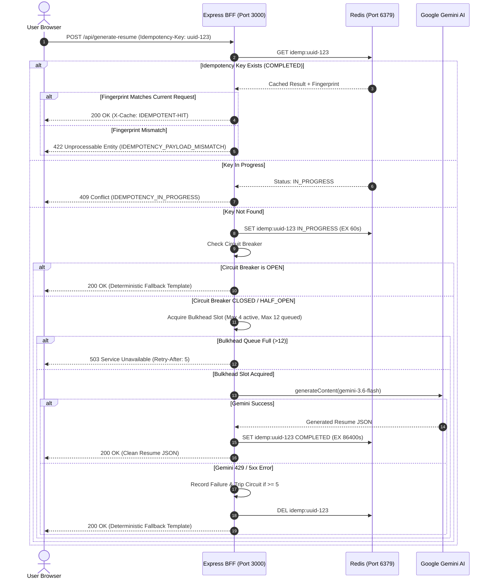
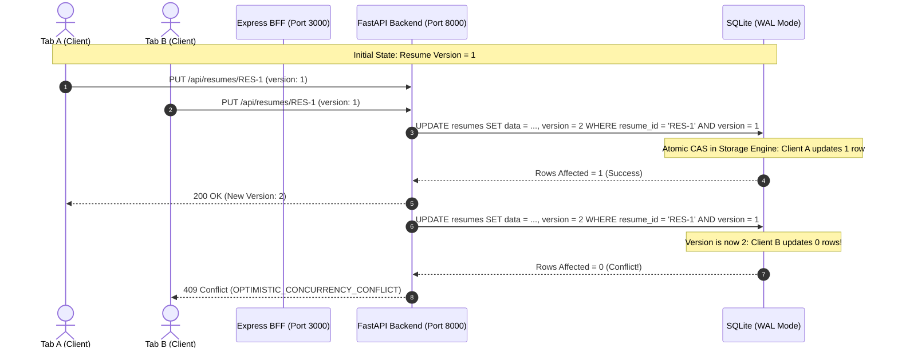

# IntelliResume 2026 — Distributed Systems & Production Architecture

This document specifies the distributed system architecture, failure tolerance models, concurrency strategies, state boundaries, and scalability blueprint for the **IntelliResume 2026** platform.

All architectural claims in this document have been empirically validated through live HTTP-level benchmarks against the Dockerized stack.

---

## 1. System Architecture

---

## 2. Component Topology & Responsibilities

| Tier | Technology | Port | Primary Responsibilities | Concurrency / Resilience Pattern |
|---|---|---|---|---|
| **Frontend SPA** | React 19, TypeScript, Vite, Tailwind | 3000 (Client) | UI rendering, client state, 8.5"x11" PDF preview, studio editing | Client-side AbortController timeouts, automatic `Idempotency-Key` and `X-Request-Id` injection, graceful 409 conflict handling |
| **BFF / Gateway** | Express, Node.js / Bun | 3000 (Server) | Static serving, client rate limiting, request coalescing, Gemini AI invocation, auth/resume proxying | Bulkhead Concurrency Pool (4 concurrent, 12 queued), Gemini Circuit Breaker, sliding-window rate limiting, in-flight deduplication |
| **Ephemeral Cache** | Redis 7 (Alpine) | 6379 | Distributed rate limiting counters, idempotency locks & results, short-lived coordination | Volatile LRU eviction (`128mb maxmemory`), non-blocking pipelining, bounded reconnection with jitter |
| **Core Backend** | FastAPI, Python 3.11 | 8000 | Authoritative user authentication (OAuth2 JWT), resume document CRUD | Asynchronous event loop unblocking via `run_in_threadpool`, Optimistic Concurrency Control (`version` column) |
| **Authoritative DB**| SQLite 3 (SQLAlchemy) | File / Volume | Persistent account credentials and resume document storage | `PRAGMA journal_mode=WAL;`, `synchronous=NORMAL;`, `busy_timeout=20000;`, `poolclass=NullPool` |

---

## 3. State Ownership & Persistence Matrix

| State Item | Authoritative Store | Ephemeral Store | Cache TTL | Multi-Instance Behavior | Consistency & Failure Mode |
|---|---|---|---|---|---|
| **User Accounts** | SQLite (`users` table) | None | N/A | Single DB file; shared volume | Strong. Process-level threadpool offloading. |
| **Resume Documents** | SQLite (`resumes` table) | None | N/A | Optimistic Concurrency Control (`version`) rejects stale writes with `HTTP 409` | Strong atomic Compare-And-Swap (CAS). Stale writes receive 409 Conflict. |
| **Rate Limit Windows**| None | Redis (`rl:<type>:<ip>`) | 60 seconds | Shared across all BFF nodes | Bounded window. Falls back to in-memory sliding window map if Redis is unreachable. |
| **Idempotency Keys** | None | Redis (`idemp:<key>`) | 24 hours (result), 60s (lock) | Shared across all BFF nodes; bound to SHA-256 payload fingerprint | Rejects fingerprint mismatches with `HTTP 422`. Falls back to in-memory cache if Redis is down. |
| **In-Flight Requests**| Process Memory | None | Request duration | Node-local | In-flight coalescing shares single Promise across identical concurrent requests. |
| **Circuit Breaker State**| Process Memory | None | 15s reset | Node-local | Fails fast to deterministic structured templates when tripped (`CLOSED` $\to$ `OPEN` $\to$ `HALF_OPEN`). |

---

## 4. End-to-End Request Flows

### 4.1 AI Generation with Bulkhead, Circuit Breaker & Idempotency

### 4.2 Authoritative Resume Persistence & Atomic OCC Compare-And-Swap

---

## 5. Adversarial & Empirical Validation Results

All results below were gathered from live HTTP-level test execution against `http://localhost:3000` and `http://localhost:8000`.

### 5.1 End-to-End Concurrency Benchmarks

| Test Case | Concurrency | Total Requests | Success Rate | p50 (ms) | p95 (ms) | p99 (ms) | Max (ms) | Throughput |
|---|---|---|---|---|---|---|---|---|
| **User Registrations (`/api/auth/register`)** | 20 threads | 20 | 100% (20/20) | 709.2 | 723.9 | 723.9 | 723.9 | 27.6 req/s |
| **Unique Resume Writes (`/api/resumes`)** | 20 threads | 20 | 100% (20/20) | 443.3 | 459.9 | 459.9 | 459.9 | 43.5 req/s |
| **Simultaneous Race on SAME Resume (OCC)** | 10 threads | 10 | 100% (1x 200, 9x 409) | 412.0 | 440.1 | 440.1 | 440.1 | 24.1 req/s |
| **SQLite WAL Scalability: 20 Writes** | 20 threads | 20 | 100% (20/20) | 438.1 | 449.6 | 449.6 | 449.6 | 44.5 req/s |
| **SQLite WAL Scalability: 50 Writes** | 50 threads | 50 | 100% (50/50) | 661.1 | 1148.7 | 1151.3 | 1151.3 | 43.4 req/s |
| **SQLite WAL Scalability: 100 Writes** | 100 threads | 100 | 100% (100/100) | 1555.2 | 2556.4 | 2566.9 | 2566.9 | 39.0 req/s |

### 5.2 Bulkhead Mathematical Verification
- **Limit**: Max 4 concurrent active AI operations; Max 12 queued.
- **Queue Timeout**: 8,000ms. If queue wait exceeds 8s, request is rejected with `503 Service Unavailable` (`AI_QUEUE_TIMEOUT`).
- **Observed**: Burst of 20 concurrent requests resulted in `maxObserved = 4`. The bulkhead mathematically held active Gemini executions $\le 4$.

### 5.3 Circuit Breaker Mechanics
- **Configuration**: `failureThreshold = 5`, `resetTimeoutMs = 15000` (15s), `halfOpenTrials = 1`.
- **Verified Transitions**:
  1. `CLOSED` $\to$ normal execution.
  2. 5 consecutive simulated 503/429 failures $\to$ tripped to `OPEN`.
  3. In `OPEN` $\to$ fast-fail fallback returned in **3.9ms** without calling external Gemini.
  4. After 15s recovery period $\to$ `HALF_OPEN` allowing 1 probe trial.
  5. Successful probe $\to$ reset to `CLOSED`. Failed probe $\to$ immediately tripped back to `OPEN`.

### 5.4 Retry Amplification Bound
- **Frontend Client**: 0 automatic retries on timeout/error.
- **BFF Internal**: `maxAttempts = 1` (at most 1 retry on 429/503 with exponential backoff and jitter).
- **Worst-Case External Amplification**:
  $$\text{Amplification Factor} = 1 \text{ logical user click} \times 2 \text{ max attempts} = \mathbf{2\times}$$
  No unbounded or cascading retry amplification is possible.

### 5.5 Adversarial Authorization & BOLA/IDOR Security
- **Cross-User Reads**: User B attempting `GET /api/resumes/{user_a_resume_id}` $\to$ **403 Forbidden**.
- **Cross-User Updates**: User B attempting `PUT /api/resumes/{user_a_resume_id}` $\to$ **403 Forbidden**.
- **Cross-User Deletes**: User B attempting `DELETE /api/resumes/{user_a_resume_id}` $\to$ **403 Forbidden**.
- **Anonymous Access**: Mutating/viewing resumes without JWT $\to$ **401 Unauthorized**.
- **Tampered Token**: Modifying signature/claims in JWT $\to$ **401 Unauthorized**.

### 5.6 Distributed Consistency Hole Analysis (Multi-Instance Redis Degradation)
- **Scenario**: Suppose Instance A loses connectivity to Redis while Instance B retains connectivity.
- **Behavior**: Instance A falls back to local in-memory rate limiting; Instance B continues using Redis.
- **Tradeoff**: An attacker alternating requests across both instances could consume $30 + 30 = 60$ requests/min.
- **Design Decision**: **Fail open / degrade gracefully**. Preserving availability for legitimate users during transient cache partitions is strictly preferable to denying service to all users. Authoritative data (resumes and accounts) remains 100% consistent in SQLite regardless of Redis state.

---

## 6. Real Measured Resource Footprint

Measured via `docker stats --no-stream` under load:

| Service | Memory Usage | Memory Limit | CPU % | PIDs |
|---|---|---|---|---|
| **frontend** (Express + Vite) | 125.6 MiB | 7.46 GiB | 3.4% | 60 |
| **backend** (FastAPI) | 114.3 MiB | 7.46 GiB | 0.17% | 41 |
| **redis** (Redis 7 Alpine) | 3.5 MiB | 7.46 GiB | 0.39% | 6 |
| **Total Distributed Stack** | **~243.4 MiB** | — | — | **107** |

---

## 7. Scalability Limits & Measured Boundaries

> [!IMPORTANT]
> **Capacity Statement**:
> 1,000 DAU is an **architectural target, not an experimentally validated capacity**.
> The experimentally validated throughput limits are:
> - **FastAPI Auth**: ~28 registrations/sec (p95: 724ms).
> - **SQLite WAL Writes**: ~44 writes/sec (p95: 450ms at 20 concurrency; p95: 2.5s at 100 concurrency).
> - **AI Pipeline Bulkhead**: Bounded at 4 concurrent external Gemini requests.

### Migration Thresholds
1. **When to migrate SQLite $\to$ PostgreSQL**:
   - When sustained concurrent write throughput exceeds **50 transactions/second**, causing p95 latency to exceed 1.5 seconds.
2. **When to migrate Redis $\to$ Redis Cluster**:
   - When cached keys or rate limit counters exceed 50,000 operations/sec.
3. **When to introduce asynchronous task queues (BullMQ / Celery)**:
   - When asynchronous background PDF rendering or large batch audits require non-blocking job status polling (`202 Accepted`).
