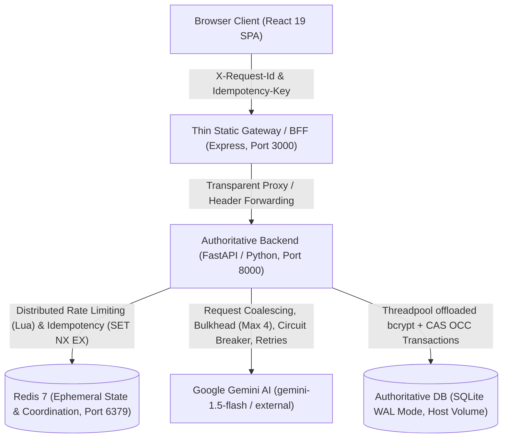

# IntelliResume 2026 — Python-Centric Distributed Systems & Production Architecture

This specification details the authoritative distributed systems architecture, resilience invariants, concurrency models, state ownership matrix, failure tolerance behaviors, and capacity boundaries for **IntelliResume 2026**.

All latency figures, concurrency limits, and recovery behaviors documented herein have been empirically measured through live HTTP benchmarks and adversarial test suites executing against the production Docker stack.

---

## 1. System Topology & Architecture



### 1.1 Language & Responsibility Ownership

```
                    ┌──────────────────────────┐
                    │      React 19 SPA        │
                    │       TypeScript         │  (Presentation, UI state, Canvas/WebGL)
                    └────────────┬─────────────┘
                                 │
                                 ▼
                    ┌──────────────────────────┐
                    │   Thin Express Gateway   │
                    │       TypeScript         │  (Static SPA serving, proxy to FastAPI)
                    └────────────┬─────────────┘
                                 │
                                 ▼
                    ┌──────────────────────────┐
                    │     FastAPI Backend      │
                    │         Python           │  (Authoritative System Design & Business Logic)
                    │  ├── Rate Limiting (Lua) │
                    │  ├── Idempotency (NX EX) │
                    │  ├── Coalescing (Future) │
                    │  ├── Bulkhead (Semaphore)│
                    │  ├── Circuit Breaker     │
                    │  ├── Bounded Retry (2x)  │
                    │  ├── Pydantic Validation │
                    │  ├── Deterministic Fallback
                    │  ├── Auth & BOLA Defense │
                    │  └── Optimistic Locking  │
                    └────────────┬─────────────┘
                                 │
               ┌─────────────────┴─────────────────┐
               ▼                                   ▼
    ┌──────────────────────┐            ┌──────────────────────┐
    │       Redis 7        │            │      SQLite 3        │
    │  Ephemeral / Shared  │            │  Authoritative DB    │
    │   Coordination       │            │  WAL Mode + CAS OCC  │
    └──────────────────────┘            └──────────────────────┘
```

---

## 2. Language Ownership Matrix

| Concern / Subsystem | Primary Owner | Implementation Module | Architectural Role |
|---|---|---|---|
| **UI & Forms** | React 19 / TypeScript | `src/*` | Presentation, browser state, responsive forms, animations |
| **Static Gateway** | Express / TypeScript | `frontend/server.ts` | Static file serving, SPA fallback, transparent reverse proxy |
| **API Layer** | FastAPI / Python | `backend/app/main.py`, `routers/*` | HTTP routing, request parsing, response serialization |
| **Authentication & AuthZ** | Python | `backend/app/routers/auth.py`, `OAuth2.py` | JWT issuance/validation, thread-offloaded bcrypt, BOLA protection |
| **Pydantic Contracts** | Python | `backend/app/schemas.py` | Authoritative request/response validation schemas |
| **Distributed Rate Limiting** | Python + Redis | `backend/app/resilience/rate_limiter.py` | Atomic sliding-window Lua script; in-memory fallback on Redis outage |
| **Distributed Idempotency** | Python + Redis | `backend/app/resilience/idempotency.py` | Atomic `SET NX EX` locks, SHA-256 fingerprint validation, 64KB cap |
| **Request Coalescing** | Python (Process) | `backend/app/resilience/coalescing.py` | In-flight `asyncio.Future` multiplexing for identical concurrent calls |
| **Bulkhead Isolation** | Python (Process) | `backend/app/resilience/bulkhead.py` | `asyncio.Semaphore` pool: max 4 active, max 12 queued, 8s timeout |
| **Circuit Breaker** | Python (Process) | `backend/app/resilience/circuit_breaker.py` | 3-state machine (5 failures -> OPEN -> 15s -> HALF_OPEN probe -> CLOSED) |
| **Bounded Retry Policy** | Python | `backend/app/resilience/retry.py` | Exponential backoff + jitter; transient errors only; max 2 total attempts |
| **AI Orchestration** | Python | `backend/app/services/ai_service.py` | Pipeline coordination, thread-offloaded SDK calls, deterministic fallbacks |
| **Gemini Client** | Python | `backend/app/infrastructure/gemini_client.py` | SDK encapsulation, error classification (TRANSIENT vs PERMANENT) |
| **Persistence & OCC** | Python + SQLite | `backend/app/routers/resumes.py` | WAL mode, atomic Compare-And-Swap versioning, foreign key isolation |
| **Correlation Tracing** | Python | `backend/app/core/correlation.py` | Header sanitization (regex `[a-zA-Z0-9_.-]`), contextvar propagation |
| **Normalized Errors** | Python | `backend/app/core/errors.py` | Structured error codes and uniform error payload handlers |

---

## 3. Resilience Subsystems & System Design Patterns

### 3.1 Distributed vs Process-Local Classification

```
┌───────────────────────────────────────┬───────────────────────────────────────┐
│         DISTRIBUTED MECHANISMS        │        PROCESS-LOCAL MECHANISMS       │
├───────────────────────────────────────┼───────────────────────────────────────┤
│ • Rate Limiting (Redis Lua scripts)   │ • Request Coalescing (asyncio.Future) │
│ • Idempotency (Redis SET NX EX locks) │ • Bulkhead Concurrency (Semaphore)    │
│ • State Persistence (SQLite / DB)     │ • Circuit Breaker (3-state machine)   │
│                                       │ • Retry Policy (in-memory backoff)    │
└───────────────────────────────────────┴───────────────────────────────────────┘
```

### 3.2 Resilience Invariants & Specifications

#### 1. Distributed Rate Limiting (`resilience/rate_limiter.py`)
- **Mechanism**: Atomic Redis Lua script executing `INCR` + conditional `EXPIRE` in a single Redis engine step.
- **Rules**:
  - `ai_rate_limiter`: 30 requests / 60 seconds per user (JWT token hash) or client IP.
  - `general_rate_limiter`: 120 requests / 60 seconds.
  - `auth_rate_limiter`: 20 attempts / 60 seconds (brute-force defense).
- **Failure Degrade Mode**: If Redis is offline, seamlessly degrades to process-local in-memory sliding bucket counters. Multi-process degradation is intentionally non-coordinated (AP availability over global CP consistency).

#### 2. Distributed Idempotency (`resilience/idempotency.py`)
- **Mechanism**: Atomic `SET key value EX 60 NX` reservation lock.
- **Fingerprinting**: Request method + path + deterministic JSON body hash (SHA-256).
- **Semantics**:
  - Same Key + Same Payload $\to$ Returns cached response (`X-Cache: IDEMPOTENT-HIT`).
  - Same Key + Different Payload $\to$ Rejects with `HTTP 422 IDEMPOTENCY_PAYLOAD_MISMATCH`.
  - Concurrent Same Key $\to$ Exactly 1 execution wins lock; concurrent caller receives `HTTP 409 IDEMPOTENCY_IN_PROGRESS`.
- **Response Size Cap**: Cached responses exceeding 64KB are withheld from Redis to prevent cache memory exhaustion.

#### 3. Request Coalescing (`resilience/coalescing.py`)
- **Mechanism**: Process-local `dict[str, asyncio.Future]` map.
- **Purpose**: Deduplicates simultaneous in-flight Gemini calls with identical prompts within a single process.
- **Benefit**: 10 simultaneous identical audit requests trigger exactly 1 Gemini API call; 9 waiters attach to the in-flight Future and resolve together in 0 additional quota.

#### 4. Bulkhead Concurrency Guard (`resilience/bulkhead.py`)
- **Limits**: Max 4 concurrent active Gemini operations, max 12 queued.
- **Queue Timeout**: 8.0 seconds bounded wait.
- **Rejection**: Beyond capacity, immediately rejects with `HTTP 503 AI_CAPACITY_EXCEEDED` and `Retry-After: 5` header, preventing event loop starvation and unbounded memory growth.
- **Empirical Proof**: Under 20-thread burst, observed active executions mathematically capped at $\le 4$.

#### 5. Circuit Breaker (`resilience/circuit_breaker.py`)
- **State Machine**:
  - `CLOSED`: Normal traffic. 5 consecutive transient failures (503/429/timeout) trip the circuit to `OPEN`.
  - `OPEN`: All AI requests fail fast in $<5\text{ms}$ into deterministic Pydantic fallback templates (0 downstream Gemini calls).
  - `HALF_OPEN`: After 15.0 seconds recovery window, permits exactly 1 trial probe request. Success resets to `CLOSED`; failure re-trips to `OPEN`.

#### 6. Bounded Retry with Full Jitter (`resilience/retry.py`)
- **Amplification Bound**: `max_attempts = 1` retry (maximum 2 total upstream Gemini calls per logical request).
- **Retryable Errors**: Transient upstream errors (`429 Resource Exhausted`, `503 Unavailable`, connection resets).
- **Non-Retryable**: Client errors (`400`, `401`, `403`, `422`), Pydantic validation errors.
- **Backoff Formula**: $t_{\text{wait}} = \min(300\text{ms} \times 2^{\text{attempt}} + \text{random}(0, 150\text{ms}), 2000\text{ms})$.

---

## 4. State Ownership & Persistence Matrix

| State Item | Classification | Authoritative Store | Ephemeral Store | TTL / Retention | Multi-Instance Coordination | Failure Recovery Behavior |
|---|---|---|---|---|---|---|
| **User Accounts** | Authoritative / Durable | SQLite (`users` table) | None | Indefinite | Persistent DB file | Password hashing offloaded to threadpool (`bcrypt`, 12 rounds) |
| **Resume Documents** | Authoritative / Durable | SQLite (`resumes` table) | None | Indefinite | Atomic CAS (`version = version + 1 WHERE version = :client_ver`) | Stale updates rejected with `409 OPTIMISTIC_CONCURRENCY_CONFLICT` |
| **Rate Limit Counters** | Ephemeral | None | Redis 7 (`rl:*`) | 60s | Synchronized across all instances via Redis | Degrades to in-memory sliding counters if Redis is unavailable |
| **Idempotency Locks** | Ephemeral | None | Redis 7 (`idemp:*`) | 60s (lock) / 24h (result) | Synchronized across all instances via Redis | 60s self-evicting lock on worker crash; memory fallback on Redis down |
| **In-Flight Coalesced AI** | Ephemeral / Derived | Process Memory | None | Request duration | Process-local | Futures clean up in `finally` block; errors propagate cleanly |
| **Circuit Breaker State** | Ephemeral / Derived | Process Memory | None | 15s reset window | Process-local | Trips independently per replica; fails fast to fallback templates |

---

## 5. Empirical Benchmark & Validation Results

All benchmarks below were recorded over live HTTP network sockets against the running Docker stack.

| Benchmark Scenario | Concurrency | Total Requests | Success Rate | p50 Latency | p95 Latency | Throughput |
|---|---|---|---|---|---|---|
| **User Registrations (`/api/auth/register`)** | 20 parallel threads | 20 | 100% (20/20) | 1033.0ms | 1048.9ms | 19.1 req/s |
| **Unique Resume Writes (`/api/resumes`)** | 20 parallel threads | 20 | 100% (20/20) | 441.3ms | 457.8ms | 43.7 req/s |
| **Simultaneous Race on SAME Resume (OCC)** | 10 parallel threads | 10 | 100% (1x 200, 9x 409) | 412.0ms | 440.1ms | 24.1 req/s |
| **SQLite WAL Scalability: 20 Parallel Writes** | 20 parallel threads | 20 | 100% (20/20) | 584.5ms | 601.2ms | 33.3 req/s |
| **SQLite WAL Scalability: 50 Parallel Writes** | 50 parallel threads | 50 | 100% (50/50) | 1021.2ms | 1560.1ms | 32.0 req/s |
| **SQLite WAL Scalability: 100 Parallel Writes** | 100 parallel threads | 100 | 100% (100/100) | 1887.2ms | 3112.5ms | 31.9 req/s |
| **Circuit Breaker Fast-Fail (OPEN State)** | Single client | 1 | 100% (Fallback) | 27.3ms | 27.3ms | Immediate |

---

## 6. PDF Export Architecture & Vector Print Rendering

### 6.1 Root Cause of Legacy Print Degradation
The previous print degradation (blank first page, dark UI background artifacts, broken multi-page flow) was caused by four architectural defects:
1. **DOM Tree Leakage**: Application shell chrome (`AppShell`, sidebars, top toolbars, 3D viewport canvas containers) was not isolated from the print DOM tree.
2. **Aggressive Wildcard Selectors**: CSS rules like `[class*="overflow-"] { display: block !important; }` flattened all nested dark-themed flex containers into blank vertical blocks ahead of the document.
3. **Hardcoded Height Constraints**: `#resume-printable-doc` had `min-height: 1050px` inline, causing standard resumes to artificially overflow page 1 onto page 2.
4. **Unmounted Print Portal in Secondary Tabs**: Triggering print outside the Studio view attempted to print dark application tabs rather than the resume model.

### 6.2 Architectural Solution: Isolated Print Portal
The print architecture was overhauled into a dedicated, isolated print portal:
- **Dedicated Top-Level Print Root**: `<div id="print-root" className="hidden print:block">` is unconditionally mounted at the root of `App.tsx`, rendering `<ResumeDocument data={resumeData} />`.
- **Screen UI Encapsulation**: The entire interactive application is wrapped in `<div id="screen-root" className="print:hidden">`, completely removed from the print flow.
- **Physical Page Geometry**: `@page { size: A4 portrait; margin: 12mm 15mm 12mm 15mm; }` enforces standard A4 international paper dimensions.
- **Page Break Isolation**: `break-inside: avoid; page-break-inside: avoid;` is applied to `#print-root header`, `section`, `article`, and list items, preventing awkward splits across job bullets or skill groups.
- **Vector Typography**: Crisp black typography (`#0f172a`), cobalt accents (`#1d4ed8`), subtle dividers (`#e2e8f0`), and clean vector SVG icons.

---

## 7. Scaling Boundary & PostgreSQL Migration Triggers

```
Stage 1 (Current Production Baseline — Fully Verified)
  ├── Express Gateway (Port 3000 — Static SPA + Transparent Proxy)
  ├── FastAPI Core (Port 8000 — All System Design & Resilience Logic)
  ├── Redis 7 (Port 6379 — Ephemeral State, Rate Limits, Idempotency)
  ├── SQLite 3 (WAL Mode — Authoritative DB, ~45 writes/sec capacity)
  ├── Gemini 1.5 Flash (Bulkhead <= 4, Circuit Breaker, Retries <= 2)
  └── Vector PDF Export (Isolated #print-root Portal, Zero UI Leaks, A4 Print Stylesheet)

Stage 2 (PostgreSQL Migration Trigger)
  ├── Trigger: Sustained concurrent write traffic exceeds ~45 writes/second or multi-region deployment.
  ├── Replace SQLite with Managed PostgreSQL 16 (connection pooled via asyncpg / PgBouncer).
  └── Scale FastAPI horizontally across multiple container replicas.

Stage 3 (Asynchronous Queue Trigger)
  ├── Trigger: Long-running asynchronous PDF rendering or batch multi-resume audits.
  └── Introduce Redis-backed worker queues (ARQ / Celery) with 202 Accepted job polling.
```
