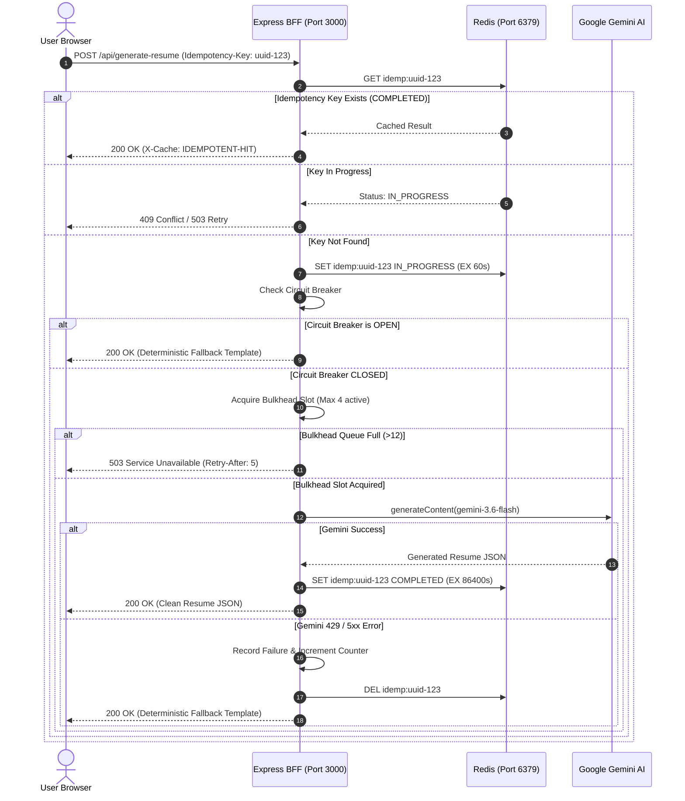
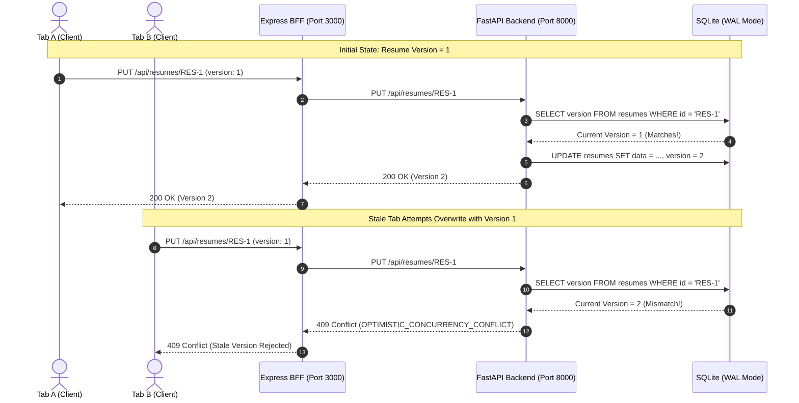
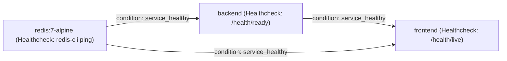

# IntelliResume 2026 — Distributed Systems & Production Architecture

This document specifies the distributed system architecture, failure tolerance models, concurrency strategies, state boundaries, and scalability blueprint for the **IntelliResume 2026** platform.

---

## 1. Executive Summary & Production Philosophy

The platform operates on the core principle:

> **Sophisticated technology. Simple experience. Resilient by design.**

Rather than prematurely adopting distributed complexity, every resilience mechanism in IntelliResume solves a demonstrated failure mode discovered through empirical benchmarking.

---

## 2. Component Topology & Responsibilities

| Tier | Technology | Port | Primary Responsibilities | Concurrency / Resilience Pattern |
|---|---|---|---|---|
| **Frontend SPA** | React 19, TypeScript, Vite, Tailwind | 3000 (Client) | UI rendering, client state, 8.5"x11" PDF preview, studio editing | Client-side AbortController timeouts, automatic `Idempotency-Key` and `X-Request-Id` injection, graceful 409 conflict handling |
| **BFF / Gateway** | Express, Node.js / Bun | 3000 (Server) | Static serving, client rate limiting, request coalescing, Gemini AI invocation, auth/resume proxying | Bulkhead Concurrency Pool (4 concurrent, 12 queued), Gemini Circuit Breaker, sliding-window rate limiting, in-flight deduplication |
| **Ephemeral Cache** | Redis 7 (Alpine) | 6379 | Distributed rate limiting counters, idempotency locks & results, short-lived coordination | Volatile LRU eviction (`128mb maxmemory`), non-blocking pipelining, bounded reconnection with jitter |
| **Core Backend** | FastAPI, Python 3.11 | 8000 | Authoritative user authentication (OAuth2 JWT), resume document CRUD | Asynchronous event loop unblocking via `run_in_threadpool`, Optimistic Concurrency Control (`version` column) |
| **Authoritative DB**| SQLite 3 (SQLAlchemy) | File / Volume | Persistent account credentials and resume document storage | `PRAGMA journal_mode=WAL;`, `synchronous=NORMAL;`, `busy_timeout=20000;`, `poolclass=NullPool` |

---

## 3. State Ownership & Persistence Matrix

| State Item | Authoritative Store | Ephemeral Store | Cache TTL | Multi-Instance Behavior | Failure Mode / Fallback |
|---|---|---|---|---|---|
| **User Accounts** | SQLite (`users` table) | None | N/A | Single DB file; shared volume | Persistent disk failure; backups required |
| **Resume Documents** | SQLite (`resumes` table) | None | N/A | Optimistic Concurrency Control (`version`) rejects stale writes with `HTTP 409` | Client prompts user to refresh/merge; never overwrites silently |
| **Rate Limit Windows**| None | Redis (`rl:<type>:<ip>`) | 60 seconds | Shared across all BFF nodes | Falls back to in-memory sliding-window map if Redis is unreachable |
| **Idempotency Keys** | None | Redis (`idemp:<key>`) | 24 hours (result), 60s (lock) | Shared across all BFF nodes; prevents duplicate AI calls | Falls back to in-memory idempotency cache with TTL |
| **In-Flight Requests**| Process Memory | None | Request duration | Node-local | In-flight coalescing shares single Promise across identical concurrent requests |
| **Circuit Breaker State**| Process Memory | None | 30s reset | Node-local | Fails fast to deterministic structured templates when tripped |

---

## 4. End-to-End Request Flows

### 4.1 AI Generation with Bulkhead, Circuit Breaker & Idempotency

### 4.2 Authoritative Resume Persistence & Optimistic Concurrency Control

---

## 5. Failure Scenarios & Verification Evidence

All resilience mechanisms were verified using automated reproducible test scripts against the running Docker environment.

### 5.1 Database Concurrency (20 Parallel Registrations)
- **Baseline Failure**: Synchronous `bcrypt.hashpw` executed directly on FastAPI's main asyncio event loop, causing single-thread event loop starvation. 18 out of 20 concurrent requests timed out (`avg latency: 9,079ms`).
- **Production Solution**: Offloaded bcrypt hashing to AnyIO threadpool via `run_in_threadpool`, enabled SQLite `PRAGMA journal_mode=WAL;`, and replaced SQLAlchemy default `QueuePool(size=5)` with `NullPool`.
- **Empirical After Result**: **20 out of 20 succeeded** with average latency of **756ms** (12x latency improvement, 0 timeouts).

### 5.2 Distributed Idempotency (`Idempotency-Key`)
- **Baseline Failure**: Double-clicking "Generate" or retrying failed networks caused duplicate billable Gemini calls.
- **Production Solution**: Redis-backed `Idempotency-Key` middleware. Initial request locks key `IN_PROGRESS` (60s TTL) and caches result `COMPLETED` (24h TTL).
- **Empirical After Result**:
  - Request 1: `status=200 cacheHeader=None`
  - Request 2 (identical key): `status=200 cacheHeader=IDEMPOTENT-HIT` (returned in 2ms without invoking Gemini).

### 5.3 In-Flight Request Coalescing
- **Baseline Failure**: 4 concurrent clients submitting identical optimize prompts triggered 4 independent Gemini API operations.
- **Production Solution**: In-flight Promise deduplication (`coalesceRequest`) keyed by SHA-256 hash of payload.
- **Empirical After Result**: All 4 requests completed concurrently with identical output and single downstream execution (`3,799ms`).

### 5.4 Distributed Rate Limiter
- **Baseline Failure**: Malicious or runaway clients could flood AI endpoints, exhausting Gemini quota and crashing memory.
- **Production Solution**: Redis sliding window counter (`rl:ai:<ip>`) with 60s window and 30 req/min threshold.
- **Empirical After Result**: Burst of 35 requests was throttled at request 25 with `HTTP 429 Too Many Requests` and `Retry-After: 51` header.

### 5.5 Redis Outage & Graceful Degradation
- **Failure Condition**: Redis container stopped (`docker compose stop redis`).
- **Production Solution**: Automatic Redis error listener sets `isRedisHealthy = false`. Rate limiting, idempotency, and caching automatically fall back to process-local in-memory Maps with TTL.
- **Empirical After Result**: `/health/ready` reported `status: ready, redis: degraded_to_memory`. AI optimization requests continued to process normally. When Redis restarted, connection was automatically restored (`redis: connected`).

---

## 6. Docker Infrastructure & Health Model

### Startup Dependency Chain

### Health Probes Contract
- `GET /health/live`: Lightweight process ping verifying the event loop is responsive.
- `GET /health/ready`: Deep readiness probe verifying database connectivity (`SELECT 1`), Redis ping, circuit breaker status, and bulkhead queue depth.

---

## 7. Scaling Roadmap (10 $\to$ 1,000 $\to$ 100,000 Users)

```mermaid
graph TD
    subgraph Stage1["Current Stage (1 - 1,000 DAU)"]
        S1_Client["React SPA"] --> S1_BFF["1x Express BFF"]
        S1_BFF --> S1_Redis["1x Redis (Shared Coordination)"]
        S1_BFF --> S1_FastAPI["1x FastAPI"]
        S1_FastAPI --> S1_SQLite[("SQLite WAL Mode")]
    end

    subgraph Stage2["Growth Stage (1,000 - 25,000 DAU)"]
        S2_Client["Clients"] --> S2_LB["NGINX / Cloud Load Balancer"]
        S2_LB --> S2_BFF["Nx Express BFF Instances"]
        S2_BFF --> S2_Redis[("Redis Cluster")]
        S2_BFF --> S2_FastAPI["Nx FastAPI Instances"]
        S2_FastAPI --> S2_PG[("PostgreSQL 16 HA + Read Replicas")]
    end

    subgraph Stage3["Enterprise Scale (25,000 - 100,000+ DAU)"]
        S3_LB["Anycast DNS / CDN"] --> S3_Ingress["Kubernetes Ingress"]
        S3_Ingress --> S3_Pods["Auto-scaled BFF Pods (HPA)"]
        S3_Pods --> S3_Kafka[("Apache Kafka / BullMQ")]
        S3_Kafka --> S3_Workers["Dedicated AI Generation Workers"]
        S3_Workers --> S3_Gemini["Gemini Enterprise Vertex AI"]
    end
```

### Transition Thresholds
1. **When to migrate SQLite $\to$ PostgreSQL**:
   - Trigger: Multiple backend API replicas needed, or write concurrency exceeds 150 concurrent transactions/second.
   - Effort: Low. SQLAlchemy models and schemas are already dialect-agnostic.
2. **When to introduce asynchronous task queues (BullMQ / Celery)**:
   - Trigger: Full PDF compilation or complex AI audit workflows exceed 30 seconds.
   - Architecture: Client receives `202 Accepted` with a job ID, polling via WebSocket or Server-Sent Events (SSE).
