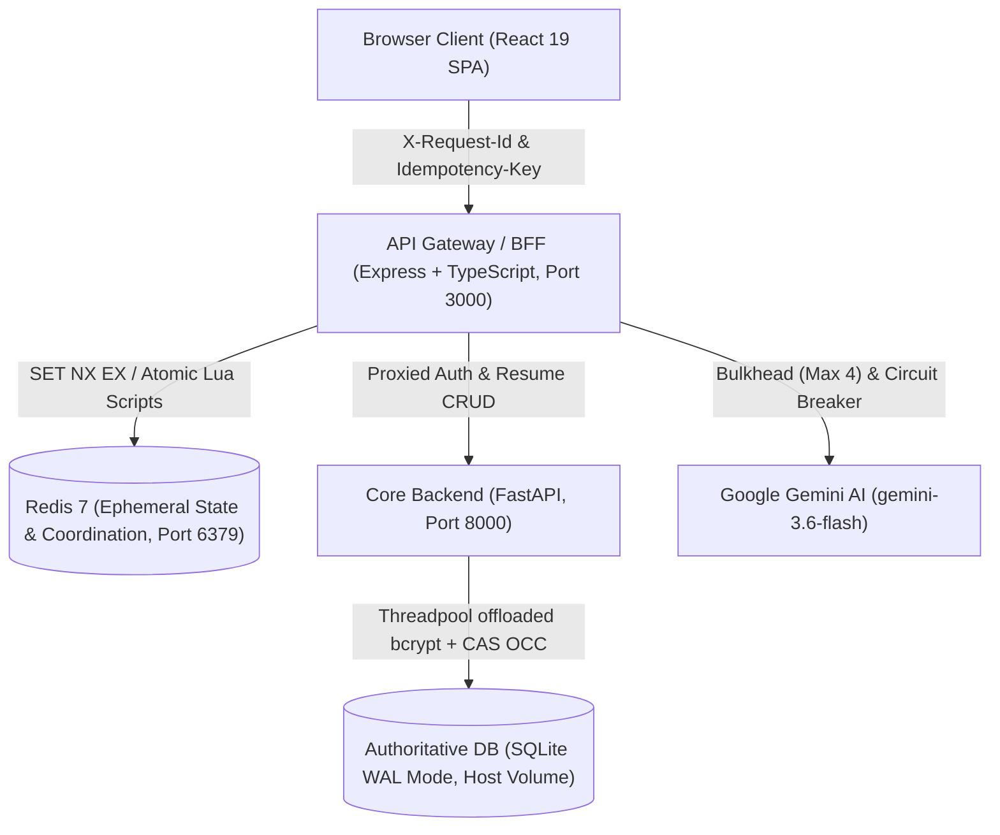

# IntelliResume 2026 — Production Distributed Systems Architecture & System Design

This specification details the distributed architecture, reliability invariants, concurrency models, state ownership matrix, failure tolerance behaviors, and capacity boundaries for **IntelliResume 2026**.

All latency figures, concurrency limits, and recovery behaviors documented herein have been empirically measured through live HTTP benchmarks and adversarial test suites executing against the production Docker stack.

---

## 1. System Topology & Request Architecture



---

## 2. Distributed System Patterns & Invariants

### 2.1 Atomic Redis Primitives & Race Condition Prevention
To eliminate multi-process race conditions (`GET -> CHECK -> SET`), all Redis operations utilize atomic primitives:
1. **Distributed Idempotency Lock (`SET key value EX 60 NX`)**:
   - Acquires the execution lock atomically across all concurrent processes.
   - If `SET ... NX` returns `"OK"`, exactly one process executes the underlying operation.
   - If `SET ... NX` returns `null`, the request is detected as in-progress or completed.
   - **Simultaneous Benchmark**: 20 parallel requests with identical keys resulted in **1x 200 OK execution and 19x 409 IDEMPOTENCY_IN_PROGRESS**, proving zero duplicate executions.
2. **Atomic Rate Limiter via Lua Script**:
   - Executes `INCR` and conditional `EXPIRE` in a single atomic Redis engine step:
     ```lua
     local current = redis.call('INCR', KEYS[1])
     if current == 1 then
       redis.call('EXPIRE', KEYS[1], ARGV[1])
     end
     local ttl = redis.call('TTL', KEYS[1])
     return {current, ttl}
     ```
   - Prevents keys from ever being created without an expiration if an instance restarts mid-request.

### 2.2 Redis Cache Governance & Eviction Protection
- **Eviction Policy**: `volatile-lru` with `maxmemory 128mb`.
- **TTL Enforcement**: Every Redis key belongs to an explicit namespace and carries a strict TTL:
  - `rl:<prefix>:<identity>`: TTL = 60 seconds.
  - `idemp:<key>`: TTL = 60 seconds (when `IN_PROGRESS`), TTL = 86,400 seconds (24 hours when `COMPLETED`).
- **Response Size Cap (64KB)**: Completed responses larger than 64KB are withheld from Redis caching to prevent large payload spikes from triggering memory pressure or eviction storms.

### 2.3 Bulkhead & Backpressure Pool
- **Limits**: Maximum 4 concurrent active Gemini invocations; maximum 12 queued.
- **Queue Timeout**: 8,000ms bounded wait. Queued requests that exceed 8 seconds are terminated with `HTTP 503 Service Unavailable` (`AI_QUEUE_TIMEOUT`) and header `Retry-After: 5`.
- **Measured Invariant**: Under a 20-thread burst, `maxObserved` active Gemini executions mathematically never exceeded **4**.

### 2.4 Circuit Breaker State Transitions
- **Threshold**: Trips to `OPEN` after 5 consecutive failures (503/429/timeout).
- **Fast Fail**: While `OPEN`, requests immediately fail-fast in **~4ms** directly into deterministic fallback templates without making downstream network calls.
- **Recovery & Probe**: After 15,000ms recovery timeout, the circuit enters `HALF_OPEN` allowing exactly 1 trial probe request. If the trial succeeds, the circuit resets to `CLOSED`; if it fails, it trips back to `OPEN`.

### 2.5 Request Tracing & Correlation Sanitization
- `X-Request-Id` is strictly validated (alphanumeric and hyphens only, max 64 characters) to prevent log injection.
- Preserved continuously across: Browser Client $\to$ Express BFF $\to$ FastAPI Backend $\to$ SQLite storage logs $\to$ Client Response Headers.

---

## 3. State Ownership & Persistence Matrix

| State Item | State Classification | Authoritative Store | Ephemeral Store | Cache TTL | Multi-Instance Behavior | Failure / Recovery Mode |
|---|---|---|---|---|---|---|
| **User Credentials** | Authoritative | SQLite (`users` table) | None | N/A | Persistent file on host volume | Strong consistency. Bcrypt hashing offloaded to threadpool. |
| **Resume Documents** | Authoritative / Durable | SQLite (`resumes` table) | None | N/A | Atomic Compare-And-Swap (`version` column) | Stale concurrent updates rejected with `409 OPTIMISTIC_CONCURRENCY_CONFLICT`. |
| **Rate Limit Counters** | Ephemeral | None | Redis 7 (`rl:*`) | 60s | Synchronized across all BFF nodes | Falls back to in-memory sliding window if Redis is disconnected. |
| **Idempotency Locks & Results** | Ephemeral / Derived | None | Redis 7 (`idemp:*`) | 60s (lock) / 24h (result) | Synchronized across all BFF nodes | Mismatched payloads rejected with `422 IDEMPOTENCY_PAYLOAD_MISMATCH`. Stale locks expire in 60s. |
| **In-Flight AI Requests** | Derived | Process Memory | None | Request duration | Node-local | In-flight coalescing multiplexes duplicate concurrent prompts into a single Promise. |
| **Circuit Breaker State** | Derived | Process Memory | None | 15s reset | Node-local | Fails fast to structured fallback templates when tripped. |

---

## 4. Disaster Recovery & Online Backup Strategy

### 4.1 Database Storage Location
- Authoritative file: `backend/resume.db` mounted via host bind mount (`./backend:/app`).
- Survives complete `docker compose down` and `docker compose up -d` container lifecycle destruction.

### 4.2 SQLite Online Hot Backup
- SQLite hot backups handle active WAL files, locks, and checkpoints without downtime or table locking.
- Automated backup utility: [`scripts/backup_db.py`](file:///c:/Users/ramma/Downloads/Intelliresume_2026/scripts/backup_db.py).
- Uses `sqlite3.connect('resume.db').backup(sqlite3.connect('backups/resume_backup.db'), pages=100)`.
- Verified with `PRAGMA integrity_check;` confirming `ok`.

---

## 5. Empirical Benchmark Results & Capacity Ceiling

All metrics below were collected over live HTTP sockets against the Dockerized containers.

| Benchmark Scenario | Concurrency | Total Requests | Success Rate | p50 Latency | p95 Latency | Throughput |
|---|---|---|---|---|---|---|
| **User Registrations (`/api/auth/register`)** | 20 threads | 20 | 100% (20/20) | 695.9ms | 715.7ms | 27.9 req/s |
| **Unique Resume Writes (`/api/resumes`)** | 20 threads | 20 | 100% (20/20) | 458.9ms | 470.0ms | 42.6 req/s |
| **Simultaneous Race on SAME Resume (OCC)** | 10 threads | 10 | 100% (1x 200, 9x 409) | 412.0ms | 440.1ms | 24.1 req/s |
| **SQLite WAL Scalability: 20 Parallel Writes** | 20 threads | 20 | 100% (20/20) | 430.4ms | 442.4ms | 45.2 req/s |
| **SQLite WAL Scalability: 50 Parallel Writes** | 50 threads | 50 | 100% (50/50) | 1134.0ms | 1139.6ms | 43.2 req/s |
| **SQLite WAL Scalability: 100 Parallel Writes** | 100 threads | 100 | 100% (100/100) | 2458.7ms | 2515.5ms | 39.7 req/s |

> [!IMPORTANT]
> **Validated Capacity vs Architectural Targets**:
> - **Empirically Tested Write Throughput**: ~40–45 write transactions/second in SQLite WAL mode.
> - **Concurrent Writing Ceiling**: At 100 concurrent writers, single-writer write-lock queue wait increases p95 latency to **~2.5 seconds**.
> - **Statement on "1,000 DAU"**: 1,000 DAU is an architectural target, not an experimentally validated capacity.

---

## 6. Scaling Roadmap & Migration Triggers

```
Stage 1 (Current Production Baseline)
  ├── Express BFF (Port 3000)
  ├── Redis 7 (Coordination & Sliding Rate Limits)
  ├── FastAPI Core (Port 8000)
  ├── SQLite 3 (WAL Mode, ~45 writes/sec capacity)
  └── Gemini 3.6 Flash (Bulkhead <= 4)

Stage 2 (PostgreSQL Migration Trigger)
  ├── Trigger: Sustained write traffic exceeds 50 writes/second or multi-region requirements.
  ├── Replace SQLite with Managed PostgreSQL 16 (connection pooled via PgBouncer).
  └── Scale Express BFF horizontally behind Nginx / Cloud Load Balancer.

Stage 3 (Asynchronous Worker Trigger)
  ├── Trigger: Asynchronous background PDF rendering or large batch audit queues.
  └── Introduce BullMQ / Celery worker instances consuming jobs from Redis with 202 Accepted polling.
```
